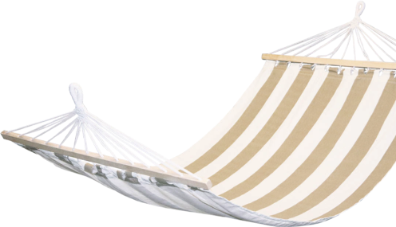

<!DOCTYPE html>
<html lang="en">
<head>
    <meta charset="UTF-8">
    <meta name="viewport" content="width=device-width, initial-scale=1.0">
    <meta http-equiv="X-UA-Compatible" content="ie=edge">
    <title>Document</title>
    <link href="https://fonts.googleapis.com/css?family=Fira+Sans:300,400,500,800&display=swap" rel="stylesheet">
    <link rel="stylesheet" href="css/style.min.css">
</head>
<body>
    <style>
    /*! normalize.css v8.0.1 | MIT License | github.com/necolas/normalize.css */html{line-height:1.15;-webkit-text-size-adjust:100%}body{margin:0}main{display:block}h1{font-size:2em;margin:0.67em 0}hr{-webkit-box-sizing:content-box;box-sizing:content-box;height:0;overflow:visible}pre{font-family:monospace, monospace;font-size:1em}a{background-color:transparent}abbr[title]{border-bottom:none;text-decoration:underline;-webkit-text-decoration:underline dotted;text-decoration:underline dotted}b,strong{font-weight:bolder}code,kbd,samp{font-family:monospace, monospace;font-size:1em}small{font-size:80%}sub,sup{font-size:75%;line-height:0;position:relative;vertical-align:baseline}sub{bottom:-0.25em}sup{top:-0.5em}img{border-style:none}button,input,optgroup,select,textarea{font-family:inherit;font-size:100%;line-height:1.15;margin:0}button,input{overflow:visible}button,select{text-transform:none}button,[type="button"],[type="reset"],[type="submit"]{-webkit-appearance:button}button::-moz-focus-inner,[type="button"]::-moz-focus-inner,[type="reset"]::-moz-focus-inner,[type="submit"]::-moz-focus-inner{border-style:none;padding:0}button:-moz-focusring,[type="button"]:-moz-focusring,[type="reset"]:-moz-focusring,[type="submit"]:-moz-focusring{outline:1px dotted ButtonText}fieldset{padding:0.35em 0.75em 0.625em}legend{-webkit-box-sizing:border-box;box-sizing:border-box;color:inherit;display:table;max-width:100%;padding:0;white-space:normal}progress{vertical-align:baseline}textarea{overflow:auto}[type="checkbox"],[type="radio"]{-webkit-box-sizing:border-box;box-sizing:border-box;padding:0}[type="number"]::-webkit-inner-spin-button,[type="number"]::-webkit-outer-spin-button{height:auto}[type="search"]{-webkit-appearance:textfield;outline-offset:-2px}[type="search"]::-webkit-search-decoration{-webkit-appearance:none}::-webkit-file-upload-button{-webkit-appearance:button;font:inherit}details{display:block}summary{display:list-item}template{display:none}[hidden]{display:none}.slick-slider{position:relative;display:block;-webkit-box-sizing:border-box;box-sizing:border-box;-webkit-user-select:none;-moz-user-select:none;-ms-user-select:none;user-select:none;-webkit-touch-callout:none;-khtml-user-select:none;-ms-touch-action:pan-y;touch-action:pan-y;-webkit-tap-highlight-color:transparent}.slick-list{position:relative;display:block;overflow:hidden;margin:0;padding:0}.slick-list:focus{outline:none}.slick-list.dragging{cursor:pointer;cursor:hand}.slick-slider .slick-track,.slick-slider .slick-list{-webkit-transform:translate3d(0, 0, 0);-ms-transform:translate3d(0, 0, 0);transform:translate3d(0, 0, 0)}.slick-track{position:relative;top:0;left:0;display:block;margin-left:auto;margin-right:auto}.slick-track:before,.slick-track:after{display:table;content:''}.slick-track:after{clear:both}.slick-loading .slick-track{visibility:hidden}.slick-slide{display:none;float:left;height:100%;min-height:1px}[dir='rtl'] .slick-slide{float:right}.slick-slide img{display:block}.slick-slide.slick-loading img{display:none}.slick-slide.dragging img{pointer-events:none}.slick-initialized .slick-slide{display:block}.slick-loading .slick-slide{visibility:hidden}.slick-vertical .slick-slide{display:block;height:auto;border:1px solid transparent}.slick-arrow.slick-hidden{display:none}.mfp-bg{top:0;left:0;width:100%;height:100%;z-index:1042;overflow:hidden;position:fixed;background:#0b0b0b;opacity:0.8}.mfp-wrap{top:0;left:0;width:100%;height:100%;z-index:1043;position:fixed;outline:none !important;-webkit-backface-visibility:hidden}.mfp-container{text-align:center;position:absolute;width:100%;height:100%;left:0;top:0;padding:0 8px;-webkit-box-sizing:border-box;box-sizing:border-box}.mfp-container:before{content:'';display:inline-block;height:100%;vertical-align:middle}.mfp-align-top .mfp-container:before{display:none}.mfp-content{position:relative;display:inline-block;vertical-align:middle;margin:0 auto;text-align:left;z-index:1045}.mfp-inline-holder .mfp-content,.mfp-ajax-holder .mfp-content{width:100%;cursor:auto}.mfp-ajax-cur{cursor:progress}.mfp-zoom-out-cur,.mfp-zoom-out-cur .mfp-image-holder .mfp-close{cursor:-webkit-zoom-out;cursor:zoom-out}.mfp-zoom{cursor:pointer;cursor:-webkit-zoom-in;cursor:zoom-in}.mfp-auto-cursor .mfp-content{cursor:auto}.mfp-close,.mfp-arrow,.mfp-preloader,.mfp-counter{-webkit-user-select:none;-moz-user-select:none;-ms-user-select:none;user-select:none}.mfp-loading.mfp-figure{display:none}.mfp-hide{display:none !important}.mfp-preloader{color:#CCC;position:absolute;top:50%;width:auto;text-align:center;margin-top:-0.8em;left:8px;right:8px;z-index:1044}.mfp-preloader a{color:#CCC}.mfp-preloader a:hover{color:#FFF}.mfp-s-ready .mfp-preloader{display:none}.mfp-s-error .mfp-content{display:none}button.mfp-close,button.mfp-arrow{overflow:visible;cursor:pointer;background:transparent;border:0;-webkit-appearance:none;display:block;outline:none;padding:0;z-index:1046;-webkit-box-shadow:none;box-shadow:none;-ms-touch-action:manipulation;touch-action:manipulation}button::-moz-focus-inner{padding:0;border:0}.mfp-close{width:44px;height:44px;line-height:44px;position:absolute;right:0;top:0;text-decoration:none;text-align:center;opacity:0.65;padding:0 0 18px 10px;color:#FFF;font-style:normal;font-size:28px;font-family:Arial, Baskerville, monospace}.mfp-close:hover,.mfp-close:focus{opacity:1}.mfp-close:active{top:1px}.mfp-close-btn-in .mfp-close{color:#333}.mfp-image-holder .mfp-close,.mfp-iframe-holder .mfp-close{color:#FFF;right:-6px;text-align:right;padding-right:6px;width:100%}.mfp-counter{position:absolute;top:0;right:0;color:#CCC;font-size:12px;line-height:18px;white-space:nowrap}.mfp-arrow{position:absolute;opacity:0.65;margin:0;top:50%;margin-top:-55px;padding:0;width:90px;height:110px;-webkit-tap-highlight-color:transparent}.mfp-arrow:active{margin-top:-54px}.mfp-arrow:hover,.mfp-arrow:focus{opacity:1}.mfp-arrow:before,.mfp-arrow:after{content:'';display:block;width:0;height:0;position:absolute;left:0;top:0;margin-top:35px;margin-left:35px;border:medium inset transparent}.mfp-arrow:after{border-top-width:13px;border-bottom-width:13px;top:8px}.mfp-arrow:before{border-top-width:21px;border-bottom-width:21px;opacity:0.7}.mfp-arrow-left{left:0}.mfp-arrow-left:after{border-right:17px solid #FFF;margin-left:31px}.mfp-arrow-left:before{margin-left:25px;border-right:27px solid #3F3F3F}.mfp-arrow-right{right:0}.mfp-arrow-right:after{border-left:17px solid #FFF;margin-left:39px}.mfp-arrow-right:before{border-left:27px solid #3F3F3F}.mfp-iframe-holder{padding-top:40px;padding-bottom:40px}.mfp-iframe-holder .mfp-content{line-height:0;width:100%;max-width:900px}.mfp-iframe-holder .mfp-close{top:-40px}.mfp-iframe-scaler{width:100%;height:0;overflow:hidden;padding-top:56.25%}.mfp-iframe-scaler iframe{position:absolute;display:block;top:0;left:0;width:100%;height:100%;-webkit-box-shadow:0 0 8px rgba(0,0,0,0.6);box-shadow:0 0 8px rgba(0,0,0,0.6);background:#000}img.mfp-img{width:auto;max-width:100%;height:auto;display:block;line-height:0;-webkit-box-sizing:border-box;box-sizing:border-box;padding:40px 0 40px;margin:0 auto}.mfp-figure{line-height:0}.mfp-figure:after{content:'';position:absolute;left:0;top:40px;bottom:40px;display:block;right:0;width:auto;height:auto;z-index:-1;-webkit-box-shadow:0 0 8px rgba(0,0,0,0.6);box-shadow:0 0 8px rgba(0,0,0,0.6);background:#444}.mfp-figure small{color:#BDBDBD;display:block;font-size:12px;line-height:14px}.mfp-figure figure{margin:0}.mfp-bottom-bar{margin-top:-36px;position:absolute;top:100%;left:0;width:100%;cursor:auto}.mfp-title{text-align:left;line-height:18px;color:#F3F3F3;word-wrap:break-word;padding-right:36px}.mfp-image-holder .mfp-content{max-width:100%}.mfp-gallery .mfp-image-holder .mfp-figure{cursor:pointer}@media screen and (max-width: 800px) and (orientation: landscape), screen and (max-height: 300px){.mfp-img-mobile .mfp-image-holder{padding-left:0;padding-right:0}.mfp-img-mobile img.mfp-img{padding:0}.mfp-img-mobile .mfp-figure:after{top:0;bottom:0}.mfp-img-mobile .mfp-figure small{display:inline;margin-left:5px}.mfp-img-mobile .mfp-bottom-bar{background:rgba(0,0,0,0.6);bottom:0;margin:0;top:auto;padding:3px 5px;position:fixed;-webkit-box-sizing:border-box;box-sizing:border-box}.mfp-img-mobile .mfp-bottom-bar:empty{padding:0}.mfp-img-mobile .mfp-counter{right:5px;top:3px}.mfp-img-mobile .mfp-close{top:0;right:0;width:35px;height:35px;line-height:35px;background:rgba(0,0,0,0.6);position:fixed;text-align:center;padding:0}}@media all and (max-width: 900px){.mfp-arrow{-webkit-transform:scale(0.75);-ms-transform:scale(0.75);transform:scale(0.75)}.mfp-arrow-left{-webkit-transform-origin:0;-ms-transform-origin:0;transform-origin:0}.mfp-arrow-right{-webkit-transform-origin:100%;-ms-transform-origin:100%;transform-origin:100%}.mfp-container{padding-left:6px;padding-right:6px}}/*!
 * animate.css -https://daneden.github.io/animate.css/
 * Version - 3.7.2
 * Licensed under the MIT license - http://opensource.org/licenses/MIT
 *
 * Copyright (c) 2019 Daniel Eden
 */@-webkit-keyframes bounce{from,20%,53%,80%,to{-webkit-animation-timing-function:cubic-bezier(0.215, 0.61, 0.355, 1);animation-timing-function:cubic-bezier(0.215, 0.61, 0.355, 1);-webkit-transform:translate3d(0, 0, 0);transform:translate3d(0, 0, 0)}40%,43%{-webkit-animation-timing-function:cubic-bezier(0.755, 0.05, 0.855, 0.06);animation-timing-function:cubic-bezier(0.755, 0.05, 0.855, 0.06);-webkit-transform:translate3d(0, -30px, 0);transform:translate3d(0, -30px, 0)}70%{-webkit-animation-timing-function:cubic-bezier(0.755, 0.05, 0.855, 0.06);animation-timing-function:cubic-bezier(0.755, 0.05, 0.855, 0.06);-webkit-transform:translate3d(0, -15px, 0);transform:translate3d(0, -15px, 0)}90%{-webkit-transform:translate3d(0, -4px, 0);transform:translate3d(0, -4px, 0)}}@keyframes bounce{from,20%,53%,80%,to{-webkit-animation-timing-function:cubic-bezier(0.215, 0.61, 0.355, 1);animation-timing-function:cubic-bezier(0.215, 0.61, 0.355, 1);-webkit-transform:translate3d(0, 0, 0);transform:translate3d(0, 0, 0)}40%,43%{-webkit-animation-timing-function:cubic-bezier(0.755, 0.05, 0.855, 0.06);animation-timing-function:cubic-bezier(0.755, 0.05, 0.855, 0.06);-webkit-transform:translate3d(0, -30px, 0);transform:translate3d(0, -30px, 0)}70%{-webkit-animation-timing-function:cubic-bezier(0.755, 0.05, 0.855, 0.06);animation-timing-function:cubic-bezier(0.755, 0.05, 0.855, 0.06);-webkit-transform:translate3d(0, -15px, 0);transform:translate3d(0, -15px, 0)}90%{-webkit-transform:translate3d(0, -4px, 0);transform:translate3d(0, -4px, 0)}}.bounce{-webkit-animation-name:bounce;animation-name:bounce;-webkit-transform-origin:center bottom;-ms-transform-origin:center bottom;transform-origin:center bottom}@-webkit-keyframes flash{from,50%,to{opacity:1}25%,75%{opacity:0}}@keyframes flash{from,50%,to{opacity:1}25%,75%{opacity:0}}.flash{-webkit-animation-name:flash;animation-name:flash}@-webkit-keyframes pulse{from{-webkit-transform:scale3d(1, 1, 1);transform:scale3d(1, 1, 1)}50%{-webkit-transform:scale3d(1.05, 1.05, 1.05);transform:scale3d(1.05, 1.05, 1.05)}to{-webkit-transform:scale3d(1, 1, 1);transform:scale3d(1, 1, 1)}}@keyframes pulse{from{-webkit-transform:scale3d(1, 1, 1);transform:scale3d(1, 1, 1)}50%{-webkit-transform:scale3d(1.05, 1.05, 1.05);transform:scale3d(1.05, 1.05, 1.05)}to{-webkit-transform:scale3d(1, 1, 1);transform:scale3d(1, 1, 1)}}.pulse{-webkit-animation-name:pulse;animation-name:pulse}@-webkit-keyframes rubberBand{from{-webkit-transform:scale3d(1, 1, 1);transform:scale3d(1, 1, 1)}30%{-webkit-transform:scale3d(1.25, 0.75, 1);transform:scale3d(1.25, 0.75, 1)}40%{-webkit-transform:scale3d(0.75, 1.25, 1);transform:scale3d(0.75, 1.25, 1)}50%{-webkit-transform:scale3d(1.15, 0.85, 1);transform:scale3d(1.15, 0.85, 1)}65%{-webkit-transform:scale3d(0.95, 1.05, 1);transform:scale3d(0.95, 1.05, 1)}75%{-webkit-transform:scale3d(1.05, 0.95, 1);transform:scale3d(1.05, 0.95, 1)}to{-webkit-transform:scale3d(1, 1, 1);transform:scale3d(1, 1, 1)}}@keyframes rubberBand{from{-webkit-transform:scale3d(1, 1, 1);transform:scale3d(1, 1, 1)}30%{-webkit-transform:scale3d(1.25, 0.75, 1);transform:scale3d(1.25, 0.75, 1)}40%{-webkit-transform:scale3d(0.75, 1.25, 1);transform:scale3d(0.75, 1.25, 1)}50%{-webkit-transform:scale3d(1.15, 0.85, 1);transform:scale3d(1.15, 0.85, 1)}65%{-webkit-transform:scale3d(0.95, 1.05, 1);transform:scale3d(0.95, 1.05, 1)}75%{-webkit-transform:scale3d(1.05, 0.95, 1);transform:scale3d(1.05, 0.95, 1)}to{-webkit-transform:scale3d(1, 1, 1);transform:scale3d(1, 1, 1)}}.rubberBand{-webkit-animation-name:rubberBand;animation-name:rubberBand}@-webkit-keyframes shake{from,to{-webkit-transform:translate3d(0, 0, 0);transform:translate3d(0, 0, 0)}10%,30%,50%,70%,90%{-webkit-transform:translate3d(-10px, 0, 0);transform:translate3d(-10px, 0, 0)}20%,40%,60%,80%{-webkit-transform:translate3d(10px, 0, 0);transform:translate3d(10px, 0, 0)}}@keyframes shake{from,to{-webkit-transform:translate3d(0, 0, 0);transform:translate3d(0, 0, 0)}10%,30%,50%,70%,90%{-webkit-transform:translate3d(-10px, 0, 0);transform:translate3d(-10px, 0, 0)}20%,40%,60%,80%{-webkit-transform:translate3d(10px, 0, 0);transform:translate3d(10px, 0, 0)}}.shake{-webkit-animation-name:shake;animation-name:shake}@-webkit-keyframes headShake{0%{-webkit-transform:translateX(0);transform:translateX(0)}6.5%{-webkit-transform:translateX(-6px) rotateY(-9deg);transform:translateX(-6px) rotateY(-9deg)}18.5%{-webkit-transform:translateX(5px) rotateY(7deg);transform:translateX(5px) rotateY(7deg)}31.5%{-webkit-transform:translateX(-3px) rotateY(-5deg);transform:translateX(-3px) rotateY(-5deg)}43.5%{-webkit-transform:translateX(2px) rotateY(3deg);transform:translateX(2px) rotateY(3deg)}50%{-webkit-transform:translateX(0);transform:translateX(0)}}@keyframes headShake{0%{-webkit-transform:translateX(0);transform:translateX(0)}6.5%{-webkit-transform:translateX(-6px) rotateY(-9deg);transform:translateX(-6px) rotateY(-9deg)}18.5%{-webkit-transform:translateX(5px) rotateY(7deg);transform:translateX(5px) rotateY(7deg)}31.5%{-webkit-transform:translateX(-3px) rotateY(-5deg);transform:translateX(-3px) rotateY(-5deg)}43.5%{-webkit-transform:translateX(2px) rotateY(3deg);transform:translateX(2px) rotateY(3deg)}50%{-webkit-transform:translateX(0);transform:translateX(0)}}.headShake{-webkit-animation-timing-function:ease-in-out;animation-timing-function:ease-in-out;-webkit-animation-name:headShake;animation-name:headShake}@-webkit-keyframes swing{20%{-webkit-transform:rotate3d(0, 0, 1, 15deg);transform:rotate3d(0, 0, 1, 15deg)}40%{-webkit-transform:rotate3d(0, 0, 1, -10deg);transform:rotate3d(0, 0, 1, -10deg)}60%{-webkit-transform:rotate3d(0, 0, 1, 5deg);transform:rotate3d(0, 0, 1, 5deg)}80%{-webkit-transform:rotate3d(0, 0, 1, -5deg);transform:rotate3d(0, 0, 1, -5deg)}to{-webkit-transform:rotate3d(0, 0, 1, 0deg);transform:rotate3d(0, 0, 1, 0deg)}}@keyframes swing{20%{-webkit-transform:rotate3d(0, 0, 1, 15deg);transform:rotate3d(0, 0, 1, 15deg)}40%{-webkit-transform:rotate3d(0, 0, 1, -10deg);transform:rotate3d(0, 0, 1, -10deg)}60%{-webkit-transform:rotate3d(0, 0, 1, 5deg);transform:rotate3d(0, 0, 1, 5deg)}80%{-webkit-transform:rotate3d(0, 0, 1, -5deg);transform:rotate3d(0, 0, 1, -5deg)}to{-webkit-transform:rotate3d(0, 0, 1, 0deg);transform:rotate3d(0, 0, 1, 0deg)}}.swing{-webkit-transform-origin:top center;-ms-transform-origin:top center;transform-origin:top center;-webkit-animation-name:swing;animation-name:swing}@-webkit-keyframes tada{from{-webkit-transform:scale3d(1, 1, 1);transform:scale3d(1, 1, 1)}10%,20%{-webkit-transform:scale3d(0.9, 0.9, 0.9) rotate3d(0, 0, 1, -3deg);transform:scale3d(0.9, 0.9, 0.9) rotate3d(0, 0, 1, -3deg)}30%,50%,70%,90%{-webkit-transform:scale3d(1.1, 1.1, 1.1) rotate3d(0, 0, 1, 3deg);transform:scale3d(1.1, 1.1, 1.1) rotate3d(0, 0, 1, 3deg)}40%,60%,80%{-webkit-transform:scale3d(1.1, 1.1, 1.1) rotate3d(0, 0, 1, -3deg);transform:scale3d(1.1, 1.1, 1.1) rotate3d(0, 0, 1, -3deg)}to{-webkit-transform:scale3d(1, 1, 1);transform:scale3d(1, 1, 1)}}@keyframes tada{from{-webkit-transform:scale3d(1, 1, 1);transform:scale3d(1, 1, 1)}10%,20%{-webkit-transform:scale3d(0.9, 0.9, 0.9) rotate3d(0, 0, 1, -3deg);transform:scale3d(0.9, 0.9, 0.9) rotate3d(0, 0, 1, -3deg)}30%,50%,70%,90%{-webkit-transform:scale3d(1.1, 1.1, 1.1) rotate3d(0, 0, 1, 3deg);transform:scale3d(1.1, 1.1, 1.1) rotate3d(0, 0, 1, 3deg)}40%,60%,80%{-webkit-transform:scale3d(1.1, 1.1, 1.1) rotate3d(0, 0, 1, -3deg);transform:scale3d(1.1, 1.1, 1.1) rotate3d(0, 0, 1, -3deg)}to{-webkit-transform:scale3d(1, 1, 1);transform:scale3d(1, 1, 1)}}.tada{-webkit-animation-name:tada;animation-name:tada}@-webkit-keyframes wobble{from{-webkit-transform:translate3d(0, 0, 0);transform:translate3d(0, 0, 0)}15%{-webkit-transform:translate3d(-25%, 0, 0) rotate3d(0, 0, 1, -5deg);transform:translate3d(-25%, 0, 0) rotate3d(0, 0, 1, -5deg)}30%{-webkit-transform:translate3d(20%, 0, 0) rotate3d(0, 0, 1, 3deg);transform:translate3d(20%, 0, 0) rotate3d(0, 0, 1, 3deg)}45%{-webkit-transform:translate3d(-15%, 0, 0) rotate3d(0, 0, 1, -3deg);transform:translate3d(-15%, 0, 0) rotate3d(0, 0, 1, -3deg)}60%{-webkit-transform:translate3d(10%, 0, 0) rotate3d(0, 0, 1, 2deg);transform:translate3d(10%, 0, 0) rotate3d(0, 0, 1, 2deg)}75%{-webkit-transform:translate3d(-5%, 0, 0) rotate3d(0, 0, 1, -1deg);transform:translate3d(-5%, 0, 0) rotate3d(0, 0, 1, -1deg)}to{-webkit-transform:translate3d(0, 0, 0);transform:translate3d(0, 0, 0)}}@keyframes wobble{from{-webkit-transform:translate3d(0, 0, 0);transform:translate3d(0, 0, 0)}15%{-webkit-transform:translate3d(-25%, 0, 0) rotate3d(0, 0, 1, -5deg);transform:translate3d(-25%, 0, 0) rotate3d(0, 0, 1, -5deg)}30%{-webkit-transform:translate3d(20%, 0, 0) rotate3d(0, 0, 1, 3deg);transform:translate3d(20%, 0, 0) rotate3d(0, 0, 1, 3deg)}45%{-webkit-transform:translate3d(-15%, 0, 0) rotate3d(0, 0, 1, -3deg);transform:translate3d(-15%, 0, 0) rotate3d(0, 0, 1, -3deg)}60%{-webkit-transform:translate3d(10%, 0, 0) rotate3d(0, 0, 1, 2deg);transform:translate3d(10%, 0, 0) rotate3d(0, 0, 1, 2deg)}75%{-webkit-transform:translate3d(-5%, 0, 0) rotate3d(0, 0, 1, -1deg);transform:translate3d(-5%, 0, 0) rotate3d(0, 0, 1, -1deg)}to{-webkit-transform:translate3d(0, 0, 0);transform:translate3d(0, 0, 0)}}.wobble{-webkit-animation-name:wobble;animation-name:wobble}@-webkit-keyframes jello{from,11.1%,to{-webkit-transform:translate3d(0, 0, 0);transform:translate3d(0, 0, 0)}22.2%{-webkit-transform:skewX(-12.5deg) skewY(-12.5deg);transform:skewX(-12.5deg) skewY(-12.5deg)}33.3%{-webkit-transform:skewX(6.25deg) skewY(6.25deg);transform:skewX(6.25deg) skewY(6.25deg)}44.4%{-webkit-transform:skewX(-3.125deg) skewY(-3.125deg);transform:skewX(-3.125deg) skewY(-3.125deg)}55.5%{-webkit-transform:skewX(1.5625deg) skewY(1.5625deg);transform:skewX(1.5625deg) skewY(1.5625deg)}66.6%{-webkit-transform:skewX(-0.78125deg) skewY(-0.78125deg);transform:skewX(-0.78125deg) skewY(-0.78125deg)}77.7%{-webkit-transform:skewX(0.39063deg) skewY(0.39063deg);transform:skewX(0.39063deg) skewY(0.39063deg)}88.8%{-webkit-transform:skewX(-0.19531deg) skewY(-0.19531deg);transform:skewX(-0.19531deg) skewY(-0.19531deg)}}@keyframes jello{from,11.1%,to{-webkit-transform:translate3d(0, 0, 0);transform:translate3d(0, 0, 0)}22.2%{-webkit-transform:skewX(-12.5deg) skewY(-12.5deg);transform:skewX(-12.5deg) skewY(-12.5deg)}33.3%{-webkit-transform:skewX(6.25deg) skewY(6.25deg);transform:skewX(6.25deg) skewY(6.25deg)}44.4%{-webkit-transform:skewX(-3.125deg) skewY(-3.125deg);transform:skewX(-3.125deg) skewY(-3.125deg)}55.5%{-webkit-transform:skewX(1.5625deg) skewY(1.5625deg);transform:skewX(1.5625deg) skewY(1.5625deg)}66.6%{-webkit-transform:skewX(-0.78125deg) skewY(-0.78125deg);transform:skewX(-0.78125deg) skewY(-0.78125deg)}77.7%{-webkit-transform:skewX(0.39063deg) skewY(0.39063deg);transform:skewX(0.39063deg) skewY(0.39063deg)}88.8%{-webkit-transform:skewX(-0.19531deg) skewY(-0.19531deg);transform:skewX(-0.19531deg) skewY(-0.19531deg)}}.jello{-webkit-animation-name:jello;animation-name:jello;-webkit-transform-origin:center;-ms-transform-origin:center;transform-origin:center}@-webkit-keyframes heartBeat{0%{-webkit-transform:scale(1);transform:scale(1)}14%{-webkit-transform:scale(1.3);transform:scale(1.3)}28%{-webkit-transform:scale(1);transform:scale(1)}42%{-webkit-transform:scale(1.3);transform:scale(1.3)}70%{-webkit-transform:scale(1);transform:scale(1)}}@keyframes heartBeat{0%{-webkit-transform:scale(1);transform:scale(1)}14%{-webkit-transform:scale(1.3);transform:scale(1.3)}28%{-webkit-transform:scale(1);transform:scale(1)}42%{-webkit-transform:scale(1.3);transform:scale(1.3)}70%{-webkit-transform:scale(1);transform:scale(1)}}.heartBeat{-webkit-animation-name:heartBeat;animation-name:heartBeat;-webkit-animation-duration:1.3s;animation-duration:1.3s;-webkit-animation-timing-function:ease-in-out;animation-timing-function:ease-in-out}@-webkit-keyframes bounceIn{from,20%,40%,60%,80%,to{-webkit-animation-timing-function:cubic-bezier(0.215, 0.61, 0.355, 1);animation-timing-function:cubic-bezier(0.215, 0.61, 0.355, 1)}0%{opacity:0;-webkit-transform:scale3d(0.3, 0.3, 0.3);transform:scale3d(0.3, 0.3, 0.3)}20%{-webkit-transform:scale3d(1.1, 1.1, 1.1);transform:scale3d(1.1, 1.1, 1.1)}40%{-webkit-transform:scale3d(0.9, 0.9, 0.9);transform:scale3d(0.9, 0.9, 0.9)}60%{opacity:1;-webkit-transform:scale3d(1.03, 1.03, 1.03);transform:scale3d(1.03, 1.03, 1.03)}80%{-webkit-transform:scale3d(0.97, 0.97, 0.97);transform:scale3d(0.97, 0.97, 0.97)}to{opacity:1;-webkit-transform:scale3d(1, 1, 1);transform:scale3d(1, 1, 1)}}@keyframes bounceIn{from,20%,40%,60%,80%,to{-webkit-animation-timing-function:cubic-bezier(0.215, 0.61, 0.355, 1);animation-timing-function:cubic-bezier(0.215, 0.61, 0.355, 1)}0%{opacity:0;-webkit-transform:scale3d(0.3, 0.3, 0.3);transform:scale3d(0.3, 0.3, 0.3)}20%{-webkit-transform:scale3d(1.1, 1.1, 1.1);transform:scale3d(1.1, 1.1, 1.1)}40%{-webkit-transform:scale3d(0.9, 0.9, 0.9);transform:scale3d(0.9, 0.9, 0.9)}60%{opacity:1;-webkit-transform:scale3d(1.03, 1.03, 1.03);transform:scale3d(1.03, 1.03, 1.03)}80%{-webkit-transform:scale3d(0.97, 0.97, 0.97);transform:scale3d(0.97, 0.97, 0.97)}to{opacity:1;-webkit-transform:scale3d(1, 1, 1);transform:scale3d(1, 1, 1)}}.bounceIn{-webkit-animation-duration:0.75s;animation-duration:0.75s;-webkit-animation-name:bounceIn;animation-name:bounceIn}@-webkit-keyframes bounceInDown{from,60%,75%,90%,to{-webkit-animation-timing-function:cubic-bezier(0.215, 0.61, 0.355, 1);animation-timing-function:cubic-bezier(0.215, 0.61, 0.355, 1)}0%{opacity:0;-webkit-transform:translate3d(0, -3000px, 0);transform:translate3d(0, -3000px, 0)}60%{opacity:1;-webkit-transform:translate3d(0, 25px, 0);transform:translate3d(0, 25px, 0)}75%{-webkit-transform:translate3d(0, -10px, 0);transform:translate3d(0, -10px, 0)}90%{-webkit-transform:translate3d(0, 5px, 0);transform:translate3d(0, 5px, 0)}to{-webkit-transform:translate3d(0, 0, 0);transform:translate3d(0, 0, 0)}}@keyframes bounceInDown{from,60%,75%,90%,to{-webkit-animation-timing-function:cubic-bezier(0.215, 0.61, 0.355, 1);animation-timing-function:cubic-bezier(0.215, 0.61, 0.355, 1)}0%{opacity:0;-webkit-transform:translate3d(0, -3000px, 0);transform:translate3d(0, -3000px, 0)}60%{opacity:1;-webkit-transform:translate3d(0, 25px, 0);transform:translate3d(0, 25px, 0)}75%{-webkit-transform:translate3d(0, -10px, 0);transform:translate3d(0, -10px, 0)}90%{-webkit-transform:translate3d(0, 5px, 0);transform:translate3d(0, 5px, 0)}to{-webkit-transform:translate3d(0, 0, 0);transform:translate3d(0, 0, 0)}}.bounceInDown{-webkit-animation-name:bounceInDown;animation-name:bounceInDown}@-webkit-keyframes bounceInLeft{from,60%,75%,90%,to{-webkit-animation-timing-function:cubic-bezier(0.215, 0.61, 0.355, 1);animation-timing-function:cubic-bezier(0.215, 0.61, 0.355, 1)}0%{opacity:0;-webkit-transform:translate3d(-3000px, 0, 0);transform:translate3d(-3000px, 0, 0)}60%{opacity:1;-webkit-transform:translate3d(25px, 0, 0);transform:translate3d(25px, 0, 0)}75%{-webkit-transform:translate3d(-10px, 0, 0);transform:translate3d(-10px, 0, 0)}90%{-webkit-transform:translate3d(5px, 0, 0);transform:translate3d(5px, 0, 0)}to{-webkit-transform:translate3d(0, 0, 0);transform:translate3d(0, 0, 0)}}@keyframes bounceInLeft{from,60%,75%,90%,to{-webkit-animation-timing-function:cubic-bezier(0.215, 0.61, 0.355, 1);animation-timing-function:cubic-bezier(0.215, 0.61, 0.355, 1)}0%{opacity:0;-webkit-transform:translate3d(-3000px, 0, 0);transform:translate3d(-3000px, 0, 0)}60%{opacity:1;-webkit-transform:translate3d(25px, 0, 0);transform:translate3d(25px, 0, 0)}75%{-webkit-transform:translate3d(-10px, 0, 0);transform:translate3d(-10px, 0, 0)}90%{-webkit-transform:translate3d(5px, 0, 0);transform:translate3d(5px, 0, 0)}to{-webkit-transform:translate3d(0, 0, 0);transform:translate3d(0, 0, 0)}}.bounceInLeft{-webkit-animation-name:bounceInLeft;animation-name:bounceInLeft}@-webkit-keyframes bounceInRight{from,60%,75%,90%,to{-webkit-animation-timing-function:cubic-bezier(0.215, 0.61, 0.355, 1);animation-timing-function:cubic-bezier(0.215, 0.61, 0.355, 1)}from{opacity:0;-webkit-transform:translate3d(3000px, 0, 0);transform:translate3d(3000px, 0, 0)}60%{opacity:1;-webkit-transform:translate3d(-25px, 0, 0);transform:translate3d(-25px, 0, 0)}75%{-webkit-transform:translate3d(10px, 0, 0);transform:translate3d(10px, 0, 0)}90%{-webkit-transform:translate3d(-5px, 0, 0);transform:translate3d(-5px, 0, 0)}to{-webkit-transform:translate3d(0, 0, 0);transform:translate3d(0, 0, 0)}}@keyframes bounceInRight{from,60%,75%,90%,to{-webkit-animation-timing-function:cubic-bezier(0.215, 0.61, 0.355, 1);animation-timing-function:cubic-bezier(0.215, 0.61, 0.355, 1)}from{opacity:0;-webkit-transform:translate3d(3000px, 0, 0);transform:translate3d(3000px, 0, 0)}60%{opacity:1;-webkit-transform:translate3d(-25px, 0, 0);transform:translate3d(-25px, 0, 0)}75%{-webkit-transform:translate3d(10px, 0, 0);transform:translate3d(10px, 0, 0)}90%{-webkit-transform:translate3d(-5px, 0, 0);transform:translate3d(-5px, 0, 0)}to{-webkit-transform:translate3d(0, 0, 0);transform:translate3d(0, 0, 0)}}.bounceInRight{-webkit-animation-name:bounceInRight;animation-name:bounceInRight}@-webkit-keyframes bounceInUp{from,60%,75%,90%,to{-webkit-animation-timing-function:cubic-bezier(0.215, 0.61, 0.355, 1);animation-timing-function:cubic-bezier(0.215, 0.61, 0.355, 1)}from{opacity:0;-webkit-transform:translate3d(0, 3000px, 0);transform:translate3d(0, 3000px, 0)}60%{opacity:1;-webkit-transform:translate3d(0, -20px, 0);transform:translate3d(0, -20px, 0)}75%{-webkit-transform:translate3d(0, 10px, 0);transform:translate3d(0, 10px, 0)}90%{-webkit-transform:translate3d(0, -5px, 0);transform:translate3d(0, -5px, 0)}to{-webkit-transform:translate3d(0, 0, 0);transform:translate3d(0, 0, 0)}}@keyframes bounceInUp{from,60%,75%,90%,to{-webkit-animation-timing-function:cubic-bezier(0.215, 0.61, 0.355, 1);animation-timing-function:cubic-bezier(0.215, 0.61, 0.355, 1)}from{opacity:0;-webkit-transform:translate3d(0, 3000px, 0);transform:translate3d(0, 3000px, 0)}60%{opacity:1;-webkit-transform:translate3d(0, -20px, 0);transform:translate3d(0, -20px, 0)}75%{-webkit-transform:translate3d(0, 10px, 0);transform:translate3d(0, 10px, 0)}90%{-webkit-transform:translate3d(0, -5px, 0);transform:translate3d(0, -5px, 0)}to{-webkit-transform:translate3d(0, 0, 0);transform:translate3d(0, 0, 0)}}.bounceInUp{-webkit-animation-name:bounceInUp;animation-name:bounceInUp}@-webkit-keyframes bounceOut{20%{-webkit-transform:scale3d(0.9, 0.9, 0.9);transform:scale3d(0.9, 0.9, 0.9)}50%,55%{opacity:1;-webkit-transform:scale3d(1.1, 1.1, 1.1);transform:scale3d(1.1, 1.1, 1.1)}to{opacity:0;-webkit-transform:scale3d(0.3, 0.3, 0.3);transform:scale3d(0.3, 0.3, 0.3)}}@keyframes bounceOut{20%{-webkit-transform:scale3d(0.9, 0.9, 0.9);transform:scale3d(0.9, 0.9, 0.9)}50%,55%{opacity:1;-webkit-transform:scale3d(1.1, 1.1, 1.1);transform:scale3d(1.1, 1.1, 1.1)}to{opacity:0;-webkit-transform:scale3d(0.3, 0.3, 0.3);transform:scale3d(0.3, 0.3, 0.3)}}.bounceOut{-webkit-animation-duration:0.75s;animation-duration:0.75s;-webkit-animation-name:bounceOut;animation-name:bounceOut}@-webkit-keyframes bounceOutDown{20%{-webkit-transform:translate3d(0, 10px, 0);transform:translate3d(0, 10px, 0)}40%,45%{opacity:1;-webkit-transform:translate3d(0, -20px, 0);transform:translate3d(0, -20px, 0)}to{opacity:0;-webkit-transform:translate3d(0, 2000px, 0);transform:translate3d(0, 2000px, 0)}}@keyframes bounceOutDown{20%{-webkit-transform:translate3d(0, 10px, 0);transform:translate3d(0, 10px, 0)}40%,45%{opacity:1;-webkit-transform:translate3d(0, -20px, 0);transform:translate3d(0, -20px, 0)}to{opacity:0;-webkit-transform:translate3d(0, 2000px, 0);transform:translate3d(0, 2000px, 0)}}.bounceOutDown{-webkit-animation-name:bounceOutDown;animation-name:bounceOutDown}@-webkit-keyframes bounceOutLeft{20%{opacity:1;-webkit-transform:translate3d(20px, 0, 0);transform:translate3d(20px, 0, 0)}to{opacity:0;-webkit-transform:translate3d(-2000px, 0, 0);transform:translate3d(-2000px, 0, 0)}}@keyframes bounceOutLeft{20%{opacity:1;-webkit-transform:translate3d(20px, 0, 0);transform:translate3d(20px, 0, 0)}to{opacity:0;-webkit-transform:translate3d(-2000px, 0, 0);transform:translate3d(-2000px, 0, 0)}}.bounceOutLeft{-webkit-animation-name:bounceOutLeft;animation-name:bounceOutLeft}@-webkit-keyframes bounceOutRight{20%{opacity:1;-webkit-transform:translate3d(-20px, 0, 0);transform:translate3d(-20px, 0, 0)}to{opacity:0;-webkit-transform:translate3d(2000px, 0, 0);transform:translate3d(2000px, 0, 0)}}@keyframes bounceOutRight{20%{opacity:1;-webkit-transform:translate3d(-20px, 0, 0);transform:translate3d(-20px, 0, 0)}to{opacity:0;-webkit-transform:translate3d(2000px, 0, 0);transform:translate3d(2000px, 0, 0)}}.bounceOutRight{-webkit-animation-name:bounceOutRight;animation-name:bounceOutRight}@-webkit-keyframes bounceOutUp{20%{-webkit-transform:translate3d(0, -10px, 0);transform:translate3d(0, -10px, 0)}40%,45%{opacity:1;-webkit-transform:translate3d(0, 20px, 0);transform:translate3d(0, 20px, 0)}to{opacity:0;-webkit-transform:translate3d(0, -2000px, 0);transform:translate3d(0, -2000px, 0)}}@keyframes bounceOutUp{20%{-webkit-transform:translate3d(0, -10px, 0);transform:translate3d(0, -10px, 0)}40%,45%{opacity:1;-webkit-transform:translate3d(0, 20px, 0);transform:translate3d(0, 20px, 0)}to{opacity:0;-webkit-transform:translate3d(0, -2000px, 0);transform:translate3d(0, -2000px, 0)}}.bounceOutUp{-webkit-animation-name:bounceOutUp;animation-name:bounceOutUp}@-webkit-keyframes fadeIn{from{opacity:0}to{opacity:1}}@keyframes fadeIn{from{opacity:0}to{opacity:1}}.fadeIn{-webkit-animation-name:fadeIn;animation-name:fadeIn}@-webkit-keyframes fadeInDown{from{opacity:0;-webkit-transform:translate3d(0, -100%, 0);transform:translate3d(0, -100%, 0)}to{opacity:1;-webkit-transform:translate3d(0, 0, 0);transform:translate3d(0, 0, 0)}}@keyframes fadeInDown{from{opacity:0;-webkit-transform:translate3d(0, -100%, 0);transform:translate3d(0, -100%, 0)}to{opacity:1;-webkit-transform:translate3d(0, 0, 0);transform:translate3d(0, 0, 0)}}.fadeInDown{-webkit-animation-name:fadeInDown;animation-name:fadeInDown}@-webkit-keyframes fadeInDownBig{from{opacity:0;-webkit-transform:translate3d(0, -2000px, 0);transform:translate3d(0, -2000px, 0)}to{opacity:1;-webkit-transform:translate3d(0, 0, 0);transform:translate3d(0, 0, 0)}}@keyframes fadeInDownBig{from{opacity:0;-webkit-transform:translate3d(0, -2000px, 0);transform:translate3d(0, -2000px, 0)}to{opacity:1;-webkit-transform:translate3d(0, 0, 0);transform:translate3d(0, 0, 0)}}.fadeInDownBig{-webkit-animation-name:fadeInDownBig;animation-name:fadeInDownBig}@-webkit-keyframes fadeInLeft{from{opacity:0;-webkit-transform:translate3d(-100%, 0, 0);transform:translate3d(-100%, 0, 0)}to{opacity:1;-webkit-transform:translate3d(0, 0, 0);transform:translate3d(0, 0, 0)}}@keyframes fadeInLeft{from{opacity:0;-webkit-transform:translate3d(-100%, 0, 0);transform:translate3d(-100%, 0, 0)}to{opacity:1;-webkit-transform:translate3d(0, 0, 0);transform:translate3d(0, 0, 0)}}.fadeInLeft{-webkit-animation-name:fadeInLeft;animation-name:fadeInLeft}@-webkit-keyframes fadeInLeftBig{from{opacity:0;-webkit-transform:translate3d(-2000px, 0, 0);transform:translate3d(-2000px, 0, 0)}to{opacity:1;-webkit-transform:translate3d(0, 0, 0);transform:translate3d(0, 0, 0)}}@keyframes fadeInLeftBig{from{opacity:0;-webkit-transform:translate3d(-2000px, 0, 0);transform:translate3d(-2000px, 0, 0)}to{opacity:1;-webkit-transform:translate3d(0, 0, 0);transform:translate3d(0, 0, 0)}}.fadeInLeftBig{-webkit-animation-name:fadeInLeftBig;animation-name:fadeInLeftBig}@-webkit-keyframes fadeInRight{from{opacity:0;-webkit-transform:translate3d(100%, 0, 0);transform:translate3d(100%, 0, 0)}to{opacity:1;-webkit-transform:translate3d(0, 0, 0);transform:translate3d(0, 0, 0)}}@keyframes fadeInRight{from{opacity:0;-webkit-transform:translate3d(100%, 0, 0);transform:translate3d(100%, 0, 0)}to{opacity:1;-webkit-transform:translate3d(0, 0, 0);transform:translate3d(0, 0, 0)}}.fadeInRight{-webkit-animation-name:fadeInRight;animation-name:fadeInRight}@-webkit-keyframes fadeInRightBig{from{opacity:0;-webkit-transform:translate3d(2000px, 0, 0);transform:translate3d(2000px, 0, 0)}to{opacity:1;-webkit-transform:translate3d(0, 0, 0);transform:translate3d(0, 0, 0)}}@keyframes fadeInRightBig{from{opacity:0;-webkit-transform:translate3d(2000px, 0, 0);transform:translate3d(2000px, 0, 0)}to{opacity:1;-webkit-transform:translate3d(0, 0, 0);transform:translate3d(0, 0, 0)}}.fadeInRightBig{-webkit-animation-name:fadeInRightBig;animation-name:fadeInRightBig}@-webkit-keyframes fadeInUp{from{opacity:0;-webkit-transform:translate3d(0, 100%, 0);transform:translate3d(0, 100%, 0)}to{opacity:1;-webkit-transform:translate3d(0, 0, 0);transform:translate3d(0, 0, 0)}}@keyframes fadeInUp{from{opacity:0;-webkit-transform:translate3d(0, 100%, 0);transform:translate3d(0, 100%, 0)}to{opacity:1;-webkit-transform:translate3d(0, 0, 0);transform:translate3d(0, 0, 0)}}.fadeInUp{-webkit-animation-name:fadeInUp;animation-name:fadeInUp}@-webkit-keyframes fadeInUpBig{from{opacity:0;-webkit-transform:translate3d(0, 2000px, 0);transform:translate3d(0, 2000px, 0)}to{opacity:1;-webkit-transform:translate3d(0, 0, 0);transform:translate3d(0, 0, 0)}}@keyframes fadeInUpBig{from{opacity:0;-webkit-transform:translate3d(0, 2000px, 0);transform:translate3d(0, 2000px, 0)}to{opacity:1;-webkit-transform:translate3d(0, 0, 0);transform:translate3d(0, 0, 0)}}.fadeInUpBig{-webkit-animation-name:fadeInUpBig;animation-name:fadeInUpBig}@-webkit-keyframes fadeOut{from{opacity:1}to{opacity:0}}@keyframes fadeOut{from{opacity:1}to{opacity:0}}.fadeOut{-webkit-animation-name:fadeOut;animation-name:fadeOut}@-webkit-keyframes fadeOutDown{from{opacity:1}to{opacity:0;-webkit-transform:translate3d(0, 100%, 0);transform:translate3d(0, 100%, 0)}}@keyframes fadeOutDown{from{opacity:1}to{opacity:0;-webkit-transform:translate3d(0, 100%, 0);transform:translate3d(0, 100%, 0)}}.fadeOutDown{-webkit-animation-name:fadeOutDown;animation-name:fadeOutDown}@-webkit-keyframes fadeOutDownBig{from{opacity:1}to{opacity:0;-webkit-transform:translate3d(0, 2000px, 0);transform:translate3d(0, 2000px, 0)}}@keyframes fadeOutDownBig{from{opacity:1}to{opacity:0;-webkit-transform:translate3d(0, 2000px, 0);transform:translate3d(0, 2000px, 0)}}.fadeOutDownBig{-webkit-animation-name:fadeOutDownBig;animation-name:fadeOutDownBig}@-webkit-keyframes fadeOutLeft{from{opacity:1}to{opacity:0;-webkit-transform:translate3d(-100%, 0, 0);transform:translate3d(-100%, 0, 0)}}@keyframes fadeOutLeft{from{opacity:1}to{opacity:0;-webkit-transform:translate3d(-100%, 0, 0);transform:translate3d(-100%, 0, 0)}}.fadeOutLeft{-webkit-animation-name:fadeOutLeft;animation-name:fadeOutLeft}@-webkit-keyframes fadeOutLeftBig{from{opacity:1}to{opacity:0;-webkit-transform:translate3d(-2000px, 0, 0);transform:translate3d(-2000px, 0, 0)}}@keyframes fadeOutLeftBig{from{opacity:1}to{opacity:0;-webkit-transform:translate3d(-2000px, 0, 0);transform:translate3d(-2000px, 0, 0)}}.fadeOutLeftBig{-webkit-animation-name:fadeOutLeftBig;animation-name:fadeOutLeftBig}@-webkit-keyframes fadeOutRight{from{opacity:1}to{opacity:0;-webkit-transform:translate3d(100%, 0, 0);transform:translate3d(100%, 0, 0)}}@keyframes fadeOutRight{from{opacity:1}to{opacity:0;-webkit-transform:translate3d(100%, 0, 0);transform:translate3d(100%, 0, 0)}}.fadeOutRight{-webkit-animation-name:fadeOutRight;animation-name:fadeOutRight}@-webkit-keyframes fadeOutRightBig{from{opacity:1}to{opacity:0;-webkit-transform:translate3d(2000px, 0, 0);transform:translate3d(2000px, 0, 0)}}@keyframes fadeOutRightBig{from{opacity:1}to{opacity:0;-webkit-transform:translate3d(2000px, 0, 0);transform:translate3d(2000px, 0, 0)}}.fadeOutRightBig{-webkit-animation-name:fadeOutRightBig;animation-name:fadeOutRightBig}@-webkit-keyframes fadeOutUp{from{opacity:1}to{opacity:0;-webkit-transform:translate3d(0, -100%, 0);transform:translate3d(0, -100%, 0)}}@keyframes fadeOutUp{from{opacity:1}to{opacity:0;-webkit-transform:translate3d(0, -100%, 0);transform:translate3d(0, -100%, 0)}}.fadeOutUp{-webkit-animation-name:fadeOutUp;animation-name:fadeOutUp}@-webkit-keyframes fadeOutUpBig{from{opacity:1}to{opacity:0;-webkit-transform:translate3d(0, -2000px, 0);transform:translate3d(0, -2000px, 0)}}@keyframes fadeOutUpBig{from{opacity:1}to{opacity:0;-webkit-transform:translate3d(0, -2000px, 0);transform:translate3d(0, -2000px, 0)}}.fadeOutUpBig{-webkit-animation-name:fadeOutUpBig;animation-name:fadeOutUpBig}@-webkit-keyframes flip{from{-webkit-transform:perspective(400px) scale3d(1, 1, 1) translate3d(0, 0, 0) rotate3d(0, 1, 0, -360deg);transform:perspective(400px) scale3d(1, 1, 1) translate3d(0, 0, 0) rotate3d(0, 1, 0, -360deg);-webkit-animation-timing-function:ease-out;animation-timing-function:ease-out}40%{-webkit-transform:perspective(400px) scale3d(1, 1, 1) translate3d(0, 0, 150px) rotate3d(0, 1, 0, -190deg);transform:perspective(400px) scale3d(1, 1, 1) translate3d(0, 0, 150px) rotate3d(0, 1, 0, -190deg);-webkit-animation-timing-function:ease-out;animation-timing-function:ease-out}50%{-webkit-transform:perspective(400px) scale3d(1, 1, 1) translate3d(0, 0, 150px) rotate3d(0, 1, 0, -170deg);transform:perspective(400px) scale3d(1, 1, 1) translate3d(0, 0, 150px) rotate3d(0, 1, 0, -170deg);-webkit-animation-timing-function:ease-in;animation-timing-function:ease-in}80%{-webkit-transform:perspective(400px) scale3d(0.95, 0.95, 0.95) translate3d(0, 0, 0) rotate3d(0, 1, 0, 0deg);transform:perspective(400px) scale3d(0.95, 0.95, 0.95) translate3d(0, 0, 0) rotate3d(0, 1, 0, 0deg);-webkit-animation-timing-function:ease-in;animation-timing-function:ease-in}to{-webkit-transform:perspective(400px) scale3d(1, 1, 1) translate3d(0, 0, 0) rotate3d(0, 1, 0, 0deg);transform:perspective(400px) scale3d(1, 1, 1) translate3d(0, 0, 0) rotate3d(0, 1, 0, 0deg);-webkit-animation-timing-function:ease-in;animation-timing-function:ease-in}}@keyframes flip{from{-webkit-transform:perspective(400px) scale3d(1, 1, 1) translate3d(0, 0, 0) rotate3d(0, 1, 0, -360deg);transform:perspective(400px) scale3d(1, 1, 1) translate3d(0, 0, 0) rotate3d(0, 1, 0, -360deg);-webkit-animation-timing-function:ease-out;animation-timing-function:ease-out}40%{-webkit-transform:perspective(400px) scale3d(1, 1, 1) translate3d(0, 0, 150px) rotate3d(0, 1, 0, -190deg);transform:perspective(400px) scale3d(1, 1, 1) translate3d(0, 0, 150px) rotate3d(0, 1, 0, -190deg);-webkit-animation-timing-function:ease-out;animation-timing-function:ease-out}50%{-webkit-transform:perspective(400px) scale3d(1, 1, 1) translate3d(0, 0, 150px) rotate3d(0, 1, 0, -170deg);transform:perspective(400px) scale3d(1, 1, 1) translate3d(0, 0, 150px) rotate3d(0, 1, 0, -170deg);-webkit-animation-timing-function:ease-in;animation-timing-function:ease-in}80%{-webkit-transform:perspective(400px) scale3d(0.95, 0.95, 0.95) translate3d(0, 0, 0) rotate3d(0, 1, 0, 0deg);transform:perspective(400px) scale3d(0.95, 0.95, 0.95) translate3d(0, 0, 0) rotate3d(0, 1, 0, 0deg);-webkit-animation-timing-function:ease-in;animation-timing-function:ease-in}to{-webkit-transform:perspective(400px) scale3d(1, 1, 1) translate3d(0, 0, 0) rotate3d(0, 1, 0, 0deg);transform:perspective(400px) scale3d(1, 1, 1) translate3d(0, 0, 0) rotate3d(0, 1, 0, 0deg);-webkit-animation-timing-function:ease-in;animation-timing-function:ease-in}}.animated.flip{-webkit-backface-visibility:visible;backface-visibility:visible;-webkit-animation-name:flip;animation-name:flip}@-webkit-keyframes flipInX{from{-webkit-transform:perspective(400px) rotate3d(1, 0, 0, 90deg);transform:perspective(400px) rotate3d(1, 0, 0, 90deg);-webkit-animation-timing-function:ease-in;animation-timing-function:ease-in;opacity:0}40%{-webkit-transform:perspective(400px) rotate3d(1, 0, 0, -20deg);transform:perspective(400px) rotate3d(1, 0, 0, -20deg);-webkit-animation-timing-function:ease-in;animation-timing-function:ease-in}60%{-webkit-transform:perspective(400px) rotate3d(1, 0, 0, 10deg);transform:perspective(400px) rotate3d(1, 0, 0, 10deg);opacity:1}80%{-webkit-transform:perspective(400px) rotate3d(1, 0, 0, -5deg);transform:perspective(400px) rotate3d(1, 0, 0, -5deg)}to{-webkit-transform:perspective(400px);transform:perspective(400px)}}@keyframes flipInX{from{-webkit-transform:perspective(400px) rotate3d(1, 0, 0, 90deg);transform:perspective(400px) rotate3d(1, 0, 0, 90deg);-webkit-animation-timing-function:ease-in;animation-timing-function:ease-in;opacity:0}40%{-webkit-transform:perspective(400px) rotate3d(1, 0, 0, -20deg);transform:perspective(400px) rotate3d(1, 0, 0, -20deg);-webkit-animation-timing-function:ease-in;animation-timing-function:ease-in}60%{-webkit-transform:perspective(400px) rotate3d(1, 0, 0, 10deg);transform:perspective(400px) rotate3d(1, 0, 0, 10deg);opacity:1}80%{-webkit-transform:perspective(400px) rotate3d(1, 0, 0, -5deg);transform:perspective(400px) rotate3d(1, 0, 0, -5deg)}to{-webkit-transform:perspective(400px);transform:perspective(400px)}}.flipInX{-webkit-backface-visibility:visible !important;backface-visibility:visible !important;-webkit-animation-name:flipInX;animation-name:flipInX}@-webkit-keyframes flipInY{from{-webkit-transform:perspective(400px) rotate3d(0, 1, 0, 90deg);transform:perspective(400px) rotate3d(0, 1, 0, 90deg);-webkit-animation-timing-function:ease-in;animation-timing-function:ease-in;opacity:0}40%{-webkit-transform:perspective(400px) rotate3d(0, 1, 0, -20deg);transform:perspective(400px) rotate3d(0, 1, 0, -20deg);-webkit-animation-timing-function:ease-in;animation-timing-function:ease-in}60%{-webkit-transform:perspective(400px) rotate3d(0, 1, 0, 10deg);transform:perspective(400px) rotate3d(0, 1, 0, 10deg);opacity:1}80%{-webkit-transform:perspective(400px) rotate3d(0, 1, 0, -5deg);transform:perspective(400px) rotate3d(0, 1, 0, -5deg)}to{-webkit-transform:perspective(400px);transform:perspective(400px)}}@keyframes flipInY{from{-webkit-transform:perspective(400px) rotate3d(0, 1, 0, 90deg);transform:perspective(400px) rotate3d(0, 1, 0, 90deg);-webkit-animation-timing-function:ease-in;animation-timing-function:ease-in;opacity:0}40%{-webkit-transform:perspective(400px) rotate3d(0, 1, 0, -20deg);transform:perspective(400px) rotate3d(0, 1, 0, -20deg);-webkit-animation-timing-function:ease-in;animation-timing-function:ease-in}60%{-webkit-transform:perspective(400px) rotate3d(0, 1, 0, 10deg);transform:perspective(400px) rotate3d(0, 1, 0, 10deg);opacity:1}80%{-webkit-transform:perspective(400px) rotate3d(0, 1, 0, -5deg);transform:perspective(400px) rotate3d(0, 1, 0, -5deg)}to{-webkit-transform:perspective(400px);transform:perspective(400px)}}.flipInY{-webkit-backface-visibility:visible !important;backface-visibility:visible !important;-webkit-animation-name:flipInY;animation-name:flipInY}@-webkit-keyframes flipOutX{from{-webkit-transform:perspective(400px);transform:perspective(400px)}30%{-webkit-transform:perspective(400px) rotate3d(1, 0, 0, -20deg);transform:perspective(400px) rotate3d(1, 0, 0, -20deg);opacity:1}to{-webkit-transform:perspective(400px) rotate3d(1, 0, 0, 90deg);transform:perspective(400px) rotate3d(1, 0, 0, 90deg);opacity:0}}@keyframes flipOutX{from{-webkit-transform:perspective(400px);transform:perspective(400px)}30%{-webkit-transform:perspective(400px) rotate3d(1, 0, 0, -20deg);transform:perspective(400px) rotate3d(1, 0, 0, -20deg);opacity:1}to{-webkit-transform:perspective(400px) rotate3d(1, 0, 0, 90deg);transform:perspective(400px) rotate3d(1, 0, 0, 90deg);opacity:0}}.flipOutX{-webkit-animation-duration:0.75s;animation-duration:0.75s;-webkit-animation-name:flipOutX;animation-name:flipOutX;-webkit-backface-visibility:visible !important;backface-visibility:visible !important}@-webkit-keyframes flipOutY{from{-webkit-transform:perspective(400px);transform:perspective(400px)}30%{-webkit-transform:perspective(400px) rotate3d(0, 1, 0, -15deg);transform:perspective(400px) rotate3d(0, 1, 0, -15deg);opacity:1}to{-webkit-transform:perspective(400px) rotate3d(0, 1, 0, 90deg);transform:perspective(400px) rotate3d(0, 1, 0, 90deg);opacity:0}}@keyframes flipOutY{from{-webkit-transform:perspective(400px);transform:perspective(400px)}30%{-webkit-transform:perspective(400px) rotate3d(0, 1, 0, -15deg);transform:perspective(400px) rotate3d(0, 1, 0, -15deg);opacity:1}to{-webkit-transform:perspective(400px) rotate3d(0, 1, 0, 90deg);transform:perspective(400px) rotate3d(0, 1, 0, 90deg);opacity:0}}.flipOutY{-webkit-animation-duration:0.75s;animation-duration:0.75s;-webkit-backface-visibility:visible !important;backface-visibility:visible !important;-webkit-animation-name:flipOutY;animation-name:flipOutY}@-webkit-keyframes lightSpeedIn{from{-webkit-transform:translate3d(100%, 0, 0) skewX(-30deg);transform:translate3d(100%, 0, 0) skewX(-30deg);opacity:0}60%{-webkit-transform:skewX(20deg);transform:skewX(20deg);opacity:1}80%{-webkit-transform:skewX(-5deg);transform:skewX(-5deg)}to{-webkit-transform:translate3d(0, 0, 0);transform:translate3d(0, 0, 0)}}@keyframes lightSpeedIn{from{-webkit-transform:translate3d(100%, 0, 0) skewX(-30deg);transform:translate3d(100%, 0, 0) skewX(-30deg);opacity:0}60%{-webkit-transform:skewX(20deg);transform:skewX(20deg);opacity:1}80%{-webkit-transform:skewX(-5deg);transform:skewX(-5deg)}to{-webkit-transform:translate3d(0, 0, 0);transform:translate3d(0, 0, 0)}}.lightSpeedIn{-webkit-animation-name:lightSpeedIn;animation-name:lightSpeedIn;-webkit-animation-timing-function:ease-out;animation-timing-function:ease-out}@-webkit-keyframes lightSpeedOut{from{opacity:1}to{-webkit-transform:translate3d(100%, 0, 0) skewX(30deg);transform:translate3d(100%, 0, 0) skewX(30deg);opacity:0}}@keyframes lightSpeedOut{from{opacity:1}to{-webkit-transform:translate3d(100%, 0, 0) skewX(30deg);transform:translate3d(100%, 0, 0) skewX(30deg);opacity:0}}.lightSpeedOut{-webkit-animation-name:lightSpeedOut;animation-name:lightSpeedOut;-webkit-animation-timing-function:ease-in;animation-timing-function:ease-in}@-webkit-keyframes rotateIn{from{-webkit-transform-origin:center;transform-origin:center;-webkit-transform:rotate3d(0, 0, 1, -200deg);transform:rotate3d(0, 0, 1, -200deg);opacity:0}to{-webkit-transform-origin:center;transform-origin:center;-webkit-transform:translate3d(0, 0, 0);transform:translate3d(0, 0, 0);opacity:1}}@keyframes rotateIn{from{-webkit-transform-origin:center;transform-origin:center;-webkit-transform:rotate3d(0, 0, 1, -200deg);transform:rotate3d(0, 0, 1, -200deg);opacity:0}to{-webkit-transform-origin:center;transform-origin:center;-webkit-transform:translate3d(0, 0, 0);transform:translate3d(0, 0, 0);opacity:1}}.rotateIn{-webkit-animation-name:rotateIn;animation-name:rotateIn}@-webkit-keyframes rotateInDownLeft{from{-webkit-transform-origin:left bottom;transform-origin:left bottom;-webkit-transform:rotate3d(0, 0, 1, -45deg);transform:rotate3d(0, 0, 1, -45deg);opacity:0}to{-webkit-transform-origin:left bottom;transform-origin:left bottom;-webkit-transform:translate3d(0, 0, 0);transform:translate3d(0, 0, 0);opacity:1}}@keyframes rotateInDownLeft{from{-webkit-transform-origin:left bottom;transform-origin:left bottom;-webkit-transform:rotate3d(0, 0, 1, -45deg);transform:rotate3d(0, 0, 1, -45deg);opacity:0}to{-webkit-transform-origin:left bottom;transform-origin:left bottom;-webkit-transform:translate3d(0, 0, 0);transform:translate3d(0, 0, 0);opacity:1}}.rotateInDownLeft{-webkit-animation-name:rotateInDownLeft;animation-name:rotateInDownLeft}@-webkit-keyframes rotateInDownRight{from{-webkit-transform-origin:right bottom;transform-origin:right bottom;-webkit-transform:rotate3d(0, 0, 1, 45deg);transform:rotate3d(0, 0, 1, 45deg);opacity:0}to{-webkit-transform-origin:right bottom;transform-origin:right bottom;-webkit-transform:translate3d(0, 0, 0);transform:translate3d(0, 0, 0);opacity:1}}@keyframes rotateInDownRight{from{-webkit-transform-origin:right bottom;transform-origin:right bottom;-webkit-transform:rotate3d(0, 0, 1, 45deg);transform:rotate3d(0, 0, 1, 45deg);opacity:0}to{-webkit-transform-origin:right bottom;transform-origin:right bottom;-webkit-transform:translate3d(0, 0, 0);transform:translate3d(0, 0, 0);opacity:1}}.rotateInDownRight{-webkit-animation-name:rotateInDownRight;animation-name:rotateInDownRight}@-webkit-keyframes rotateInUpLeft{from{-webkit-transform-origin:left bottom;transform-origin:left bottom;-webkit-transform:rotate3d(0, 0, 1, 45deg);transform:rotate3d(0, 0, 1, 45deg);opacity:0}to{-webkit-transform-origin:left bottom;transform-origin:left bottom;-webkit-transform:translate3d(0, 0, 0);transform:translate3d(0, 0, 0);opacity:1}}@keyframes rotateInUpLeft{from{-webkit-transform-origin:left bottom;transform-origin:left bottom;-webkit-transform:rotate3d(0, 0, 1, 45deg);transform:rotate3d(0, 0, 1, 45deg);opacity:0}to{-webkit-transform-origin:left bottom;transform-origin:left bottom;-webkit-transform:translate3d(0, 0, 0);transform:translate3d(0, 0, 0);opacity:1}}.rotateInUpLeft{-webkit-animation-name:rotateInUpLeft;animation-name:rotateInUpLeft}@-webkit-keyframes rotateInUpRight{from{-webkit-transform-origin:right bottom;transform-origin:right bottom;-webkit-transform:rotate3d(0, 0, 1, -90deg);transform:rotate3d(0, 0, 1, -90deg);opacity:0}to{-webkit-transform-origin:right bottom;transform-origin:right bottom;-webkit-transform:translate3d(0, 0, 0);transform:translate3d(0, 0, 0);opacity:1}}@keyframes rotateInUpRight{from{-webkit-transform-origin:right bottom;transform-origin:right bottom;-webkit-transform:rotate3d(0, 0, 1, -90deg);transform:rotate3d(0, 0, 1, -90deg);opacity:0}to{-webkit-transform-origin:right bottom;transform-origin:right bottom;-webkit-transform:translate3d(0, 0, 0);transform:translate3d(0, 0, 0);opacity:1}}.rotateInUpRight{-webkit-animation-name:rotateInUpRight;animation-name:rotateInUpRight}@-webkit-keyframes rotateOut{from{-webkit-transform-origin:center;transform-origin:center;opacity:1}to{-webkit-transform-origin:center;transform-origin:center;-webkit-transform:rotate3d(0, 0, 1, 200deg);transform:rotate3d(0, 0, 1, 200deg);opacity:0}}@keyframes rotateOut{from{-webkit-transform-origin:center;transform-origin:center;opacity:1}to{-webkit-transform-origin:center;transform-origin:center;-webkit-transform:rotate3d(0, 0, 1, 200deg);transform:rotate3d(0, 0, 1, 200deg);opacity:0}}.rotateOut{-webkit-animation-name:rotateOut;animation-name:rotateOut}@-webkit-keyframes rotateOutDownLeft{from{-webkit-transform-origin:left bottom;transform-origin:left bottom;opacity:1}to{-webkit-transform-origin:left bottom;transform-origin:left bottom;-webkit-transform:rotate3d(0, 0, 1, 45deg);transform:rotate3d(0, 0, 1, 45deg);opacity:0}}@keyframes rotateOutDownLeft{from{-webkit-transform-origin:left bottom;transform-origin:left bottom;opacity:1}to{-webkit-transform-origin:left bottom;transform-origin:left bottom;-webkit-transform:rotate3d(0, 0, 1, 45deg);transform:rotate3d(0, 0, 1, 45deg);opacity:0}}.rotateOutDownLeft{-webkit-animation-name:rotateOutDownLeft;animation-name:rotateOutDownLeft}@-webkit-keyframes rotateOutDownRight{from{-webkit-transform-origin:right bottom;transform-origin:right bottom;opacity:1}to{-webkit-transform-origin:right bottom;transform-origin:right bottom;-webkit-transform:rotate3d(0, 0, 1, -45deg);transform:rotate3d(0, 0, 1, -45deg);opacity:0}}@keyframes rotateOutDownRight{from{-webkit-transform-origin:right bottom;transform-origin:right bottom;opacity:1}to{-webkit-transform-origin:right bottom;transform-origin:right bottom;-webkit-transform:rotate3d(0, 0, 1, -45deg);transform:rotate3d(0, 0, 1, -45deg);opacity:0}}.rotateOutDownRight{-webkit-animation-name:rotateOutDownRight;animation-name:rotateOutDownRight}@-webkit-keyframes rotateOutUpLeft{from{-webkit-transform-origin:left bottom;transform-origin:left bottom;opacity:1}to{-webkit-transform-origin:left bottom;transform-origin:left bottom;-webkit-transform:rotate3d(0, 0, 1, -45deg);transform:rotate3d(0, 0, 1, -45deg);opacity:0}}@keyframes rotateOutUpLeft{from{-webkit-transform-origin:left bottom;transform-origin:left bottom;opacity:1}to{-webkit-transform-origin:left bottom;transform-origin:left bottom;-webkit-transform:rotate3d(0, 0, 1, -45deg);transform:rotate3d(0, 0, 1, -45deg);opacity:0}}.rotateOutUpLeft{-webkit-animation-name:rotateOutUpLeft;animation-name:rotateOutUpLeft}@-webkit-keyframes rotateOutUpRight{from{-webkit-transform-origin:right bottom;transform-origin:right bottom;opacity:1}to{-webkit-transform-origin:right bottom;transform-origin:right bottom;-webkit-transform:rotate3d(0, 0, 1, 90deg);transform:rotate3d(0, 0, 1, 90deg);opacity:0}}@keyframes rotateOutUpRight{from{-webkit-transform-origin:right bottom;transform-origin:right bottom;opacity:1}to{-webkit-transform-origin:right bottom;transform-origin:right bottom;-webkit-transform:rotate3d(0, 0, 1, 90deg);transform:rotate3d(0, 0, 1, 90deg);opacity:0}}.rotateOutUpRight{-webkit-animation-name:rotateOutUpRight;animation-name:rotateOutUpRight}@-webkit-keyframes hinge{0%{-webkit-transform-origin:top left;transform-origin:top left;-webkit-animation-timing-function:ease-in-out;animation-timing-function:ease-in-out}20%,60%{-webkit-transform:rotate3d(0, 0, 1, 80deg);transform:rotate3d(0, 0, 1, 80deg);-webkit-transform-origin:top left;transform-origin:top left;-webkit-animation-timing-function:ease-in-out;animation-timing-function:ease-in-out}40%,80%{-webkit-transform:rotate3d(0, 0, 1, 60deg);transform:rotate3d(0, 0, 1, 60deg);-webkit-transform-origin:top left;transform-origin:top left;-webkit-animation-timing-function:ease-in-out;animation-timing-function:ease-in-out;opacity:1}to{-webkit-transform:translate3d(0, 700px, 0);transform:translate3d(0, 700px, 0);opacity:0}}@keyframes hinge{0%{-webkit-transform-origin:top left;transform-origin:top left;-webkit-animation-timing-function:ease-in-out;animation-timing-function:ease-in-out}20%,60%{-webkit-transform:rotate3d(0, 0, 1, 80deg);transform:rotate3d(0, 0, 1, 80deg);-webkit-transform-origin:top left;transform-origin:top left;-webkit-animation-timing-function:ease-in-out;animation-timing-function:ease-in-out}40%,80%{-webkit-transform:rotate3d(0, 0, 1, 60deg);transform:rotate3d(0, 0, 1, 60deg);-webkit-transform-origin:top left;transform-origin:top left;-webkit-animation-timing-function:ease-in-out;animation-timing-function:ease-in-out;opacity:1}to{-webkit-transform:translate3d(0, 700px, 0);transform:translate3d(0, 700px, 0);opacity:0}}.hinge{-webkit-animation-duration:2s;animation-duration:2s;-webkit-animation-name:hinge;animation-name:hinge}@-webkit-keyframes jackInTheBox{from{opacity:0;-webkit-transform:scale(0.1) rotate(30deg);transform:scale(0.1) rotate(30deg);-webkit-transform-origin:center bottom;transform-origin:center bottom}50%{-webkit-transform:rotate(-10deg);transform:rotate(-10deg)}70%{-webkit-transform:rotate(3deg);transform:rotate(3deg)}to{opacity:1;-webkit-transform:scale(1);transform:scale(1)}}@keyframes jackInTheBox{from{opacity:0;-webkit-transform:scale(0.1) rotate(30deg);transform:scale(0.1) rotate(30deg);-webkit-transform-origin:center bottom;transform-origin:center bottom}50%{-webkit-transform:rotate(-10deg);transform:rotate(-10deg)}70%{-webkit-transform:rotate(3deg);transform:rotate(3deg)}to{opacity:1;-webkit-transform:scale(1);transform:scale(1)}}.jackInTheBox{-webkit-animation-name:jackInTheBox;animation-name:jackInTheBox}@-webkit-keyframes rollIn{from{opacity:0;-webkit-transform:translate3d(-100%, 0, 0) rotate3d(0, 0, 1, -120deg);transform:translate3d(-100%, 0, 0) rotate3d(0, 0, 1, -120deg)}to{opacity:1;-webkit-transform:translate3d(0, 0, 0);transform:translate3d(0, 0, 0)}}@keyframes rollIn{from{opacity:0;-webkit-transform:translate3d(-100%, 0, 0) rotate3d(0, 0, 1, -120deg);transform:translate3d(-100%, 0, 0) rotate3d(0, 0, 1, -120deg)}to{opacity:1;-webkit-transform:translate3d(0, 0, 0);transform:translate3d(0, 0, 0)}}.rollIn{-webkit-animation-name:rollIn;animation-name:rollIn}@-webkit-keyframes rollOut{from{opacity:1}to{opacity:0;-webkit-transform:translate3d(100%, 0, 0) rotate3d(0, 0, 1, 120deg);transform:translate3d(100%, 0, 0) rotate3d(0, 0, 1, 120deg)}}@keyframes rollOut{from{opacity:1}to{opacity:0;-webkit-transform:translate3d(100%, 0, 0) rotate3d(0, 0, 1, 120deg);transform:translate3d(100%, 0, 0) rotate3d(0, 0, 1, 120deg)}}.rollOut{-webkit-animation-name:rollOut;animation-name:rollOut}@-webkit-keyframes zoomIn{from{opacity:0;-webkit-transform:scale3d(0.3, 0.3, 0.3);transform:scale3d(0.3, 0.3, 0.3)}50%{opacity:1}}@keyframes zoomIn{from{opacity:0;-webkit-transform:scale3d(0.3, 0.3, 0.3);transform:scale3d(0.3, 0.3, 0.3)}50%{opacity:1}}.zoomIn{-webkit-animation-name:zoomIn;animation-name:zoomIn}@-webkit-keyframes zoomInDown{from{opacity:0;-webkit-transform:scale3d(0.1, 0.1, 0.1) translate3d(0, -1000px, 0);transform:scale3d(0.1, 0.1, 0.1) translate3d(0, -1000px, 0);-webkit-animation-timing-function:cubic-bezier(0.55, 0.055, 0.675, 0.19);animation-timing-function:cubic-bezier(0.55, 0.055, 0.675, 0.19)}60%{opacity:1;-webkit-transform:scale3d(0.475, 0.475, 0.475) translate3d(0, 60px, 0);transform:scale3d(0.475, 0.475, 0.475) translate3d(0, 60px, 0);-webkit-animation-timing-function:cubic-bezier(0.175, 0.885, 0.32, 1);animation-timing-function:cubic-bezier(0.175, 0.885, 0.32, 1)}}@keyframes zoomInDown{from{opacity:0;-webkit-transform:scale3d(0.1, 0.1, 0.1) translate3d(0, -1000px, 0);transform:scale3d(0.1, 0.1, 0.1) translate3d(0, -1000px, 0);-webkit-animation-timing-function:cubic-bezier(0.55, 0.055, 0.675, 0.19);animation-timing-function:cubic-bezier(0.55, 0.055, 0.675, 0.19)}60%{opacity:1;-webkit-transform:scale3d(0.475, 0.475, 0.475) translate3d(0, 60px, 0);transform:scale3d(0.475, 0.475, 0.475) translate3d(0, 60px, 0);-webkit-animation-timing-function:cubic-bezier(0.175, 0.885, 0.32, 1);animation-timing-function:cubic-bezier(0.175, 0.885, 0.32, 1)}}.zoomInDown{-webkit-animation-name:zoomInDown;animation-name:zoomInDown}@-webkit-keyframes zoomInLeft{from{opacity:0;-webkit-transform:scale3d(0.1, 0.1, 0.1) translate3d(-1000px, 0, 0);transform:scale3d(0.1, 0.1, 0.1) translate3d(-1000px, 0, 0);-webkit-animation-timing-function:cubic-bezier(0.55, 0.055, 0.675, 0.19);animation-timing-function:cubic-bezier(0.55, 0.055, 0.675, 0.19)}60%{opacity:1;-webkit-transform:scale3d(0.475, 0.475, 0.475) translate3d(10px, 0, 0);transform:scale3d(0.475, 0.475, 0.475) translate3d(10px, 0, 0);-webkit-animation-timing-function:cubic-bezier(0.175, 0.885, 0.32, 1);animation-timing-function:cubic-bezier(0.175, 0.885, 0.32, 1)}}@keyframes zoomInLeft{from{opacity:0;-webkit-transform:scale3d(0.1, 0.1, 0.1) translate3d(-1000px, 0, 0);transform:scale3d(0.1, 0.1, 0.1) translate3d(-1000px, 0, 0);-webkit-animation-timing-function:cubic-bezier(0.55, 0.055, 0.675, 0.19);animation-timing-function:cubic-bezier(0.55, 0.055, 0.675, 0.19)}60%{opacity:1;-webkit-transform:scale3d(0.475, 0.475, 0.475) translate3d(10px, 0, 0);transform:scale3d(0.475, 0.475, 0.475) translate3d(10px, 0, 0);-webkit-animation-timing-function:cubic-bezier(0.175, 0.885, 0.32, 1);animation-timing-function:cubic-bezier(0.175, 0.885, 0.32, 1)}}.zoomInLeft{-webkit-animation-name:zoomInLeft;animation-name:zoomInLeft}@-webkit-keyframes zoomInRight{from{opacity:0;-webkit-transform:scale3d(0.1, 0.1, 0.1) translate3d(1000px, 0, 0);transform:scale3d(0.1, 0.1, 0.1) translate3d(1000px, 0, 0);-webkit-animation-timing-function:cubic-bezier(0.55, 0.055, 0.675, 0.19);animation-timing-function:cubic-bezier(0.55, 0.055, 0.675, 0.19)}60%{opacity:1;-webkit-transform:scale3d(0.475, 0.475, 0.475) translate3d(-10px, 0, 0);transform:scale3d(0.475, 0.475, 0.475) translate3d(-10px, 0, 0);-webkit-animation-timing-function:cubic-bezier(0.175, 0.885, 0.32, 1);animation-timing-function:cubic-bezier(0.175, 0.885, 0.32, 1)}}@keyframes zoomInRight{from{opacity:0;-webkit-transform:scale3d(0.1, 0.1, 0.1) translate3d(1000px, 0, 0);transform:scale3d(0.1, 0.1, 0.1) translate3d(1000px, 0, 0);-webkit-animation-timing-function:cubic-bezier(0.55, 0.055, 0.675, 0.19);animation-timing-function:cubic-bezier(0.55, 0.055, 0.675, 0.19)}60%{opacity:1;-webkit-transform:scale3d(0.475, 0.475, 0.475) translate3d(-10px, 0, 0);transform:scale3d(0.475, 0.475, 0.475) translate3d(-10px, 0, 0);-webkit-animation-timing-function:cubic-bezier(0.175, 0.885, 0.32, 1);animation-timing-function:cubic-bezier(0.175, 0.885, 0.32, 1)}}.zoomInRight{-webkit-animation-name:zoomInRight;animation-name:zoomInRight}@-webkit-keyframes zoomInUp{from{opacity:0;-webkit-transform:scale3d(0.1, 0.1, 0.1) translate3d(0, 1000px, 0);transform:scale3d(0.1, 0.1, 0.1) translate3d(0, 1000px, 0);-webkit-animation-timing-function:cubic-bezier(0.55, 0.055, 0.675, 0.19);animation-timing-function:cubic-bezier(0.55, 0.055, 0.675, 0.19)}60%{opacity:1;-webkit-transform:scale3d(0.475, 0.475, 0.475) translate3d(0, -60px, 0);transform:scale3d(0.475, 0.475, 0.475) translate3d(0, -60px, 0);-webkit-animation-timing-function:cubic-bezier(0.175, 0.885, 0.32, 1);animation-timing-function:cubic-bezier(0.175, 0.885, 0.32, 1)}}@keyframes zoomInUp{from{opacity:0;-webkit-transform:scale3d(0.1, 0.1, 0.1) translate3d(0, 1000px, 0);transform:scale3d(0.1, 0.1, 0.1) translate3d(0, 1000px, 0);-webkit-animation-timing-function:cubic-bezier(0.55, 0.055, 0.675, 0.19);animation-timing-function:cubic-bezier(0.55, 0.055, 0.675, 0.19)}60%{opacity:1;-webkit-transform:scale3d(0.475, 0.475, 0.475) translate3d(0, -60px, 0);transform:scale3d(0.475, 0.475, 0.475) translate3d(0, -60px, 0);-webkit-animation-timing-function:cubic-bezier(0.175, 0.885, 0.32, 1);animation-timing-function:cubic-bezier(0.175, 0.885, 0.32, 1)}}.zoomInUp{-webkit-animation-name:zoomInUp;animation-name:zoomInUp}@-webkit-keyframes zoomOut{from{opacity:1}50%{opacity:0;-webkit-transform:scale3d(0.3, 0.3, 0.3);transform:scale3d(0.3, 0.3, 0.3)}to{opacity:0}}@keyframes zoomOut{from{opacity:1}50%{opacity:0;-webkit-transform:scale3d(0.3, 0.3, 0.3);transform:scale3d(0.3, 0.3, 0.3)}to{opacity:0}}.zoomOut{-webkit-animation-name:zoomOut;animation-name:zoomOut}@-webkit-keyframes zoomOutDown{40%{opacity:1;-webkit-transform:scale3d(0.475, 0.475, 0.475) translate3d(0, -60px, 0);transform:scale3d(0.475, 0.475, 0.475) translate3d(0, -60px, 0);-webkit-animation-timing-function:cubic-bezier(0.55, 0.055, 0.675, 0.19);animation-timing-function:cubic-bezier(0.55, 0.055, 0.675, 0.19)}to{opacity:0;-webkit-transform:scale3d(0.1, 0.1, 0.1) translate3d(0, 2000px, 0);transform:scale3d(0.1, 0.1, 0.1) translate3d(0, 2000px, 0);-webkit-transform-origin:center bottom;transform-origin:center bottom;-webkit-animation-timing-function:cubic-bezier(0.175, 0.885, 0.32, 1);animation-timing-function:cubic-bezier(0.175, 0.885, 0.32, 1)}}@keyframes zoomOutDown{40%{opacity:1;-webkit-transform:scale3d(0.475, 0.475, 0.475) translate3d(0, -60px, 0);transform:scale3d(0.475, 0.475, 0.475) translate3d(0, -60px, 0);-webkit-animation-timing-function:cubic-bezier(0.55, 0.055, 0.675, 0.19);animation-timing-function:cubic-bezier(0.55, 0.055, 0.675, 0.19)}to{opacity:0;-webkit-transform:scale3d(0.1, 0.1, 0.1) translate3d(0, 2000px, 0);transform:scale3d(0.1, 0.1, 0.1) translate3d(0, 2000px, 0);-webkit-transform-origin:center bottom;transform-origin:center bottom;-webkit-animation-timing-function:cubic-bezier(0.175, 0.885, 0.32, 1);animation-timing-function:cubic-bezier(0.175, 0.885, 0.32, 1)}}.zoomOutDown{-webkit-animation-name:zoomOutDown;animation-name:zoomOutDown}@-webkit-keyframes zoomOutLeft{40%{opacity:1;-webkit-transform:scale3d(0.475, 0.475, 0.475) translate3d(42px, 0, 0);transform:scale3d(0.475, 0.475, 0.475) translate3d(42px, 0, 0)}to{opacity:0;-webkit-transform:scale(0.1) translate3d(-2000px, 0, 0);transform:scale(0.1) translate3d(-2000px, 0, 0);-webkit-transform-origin:left center;transform-origin:left center}}@keyframes zoomOutLeft{40%{opacity:1;-webkit-transform:scale3d(0.475, 0.475, 0.475) translate3d(42px, 0, 0);transform:scale3d(0.475, 0.475, 0.475) translate3d(42px, 0, 0)}to{opacity:0;-webkit-transform:scale(0.1) translate3d(-2000px, 0, 0);transform:scale(0.1) translate3d(-2000px, 0, 0);-webkit-transform-origin:left center;transform-origin:left center}}.zoomOutLeft{-webkit-animation-name:zoomOutLeft;animation-name:zoomOutLeft}@-webkit-keyframes zoomOutRight{40%{opacity:1;-webkit-transform:scale3d(0.475, 0.475, 0.475) translate3d(-42px, 0, 0);transform:scale3d(0.475, 0.475, 0.475) translate3d(-42px, 0, 0)}to{opacity:0;-webkit-transform:scale(0.1) translate3d(2000px, 0, 0);transform:scale(0.1) translate3d(2000px, 0, 0);-webkit-transform-origin:right center;transform-origin:right center}}@keyframes zoomOutRight{40%{opacity:1;-webkit-transform:scale3d(0.475, 0.475, 0.475) translate3d(-42px, 0, 0);transform:scale3d(0.475, 0.475, 0.475) translate3d(-42px, 0, 0)}to{opacity:0;-webkit-transform:scale(0.1) translate3d(2000px, 0, 0);transform:scale(0.1) translate3d(2000px, 0, 0);-webkit-transform-origin:right center;transform-origin:right center}}.zoomOutRight{-webkit-animation-name:zoomOutRight;animation-name:zoomOutRight}@-webkit-keyframes zoomOutUp{40%{opacity:1;-webkit-transform:scale3d(0.475, 0.475, 0.475) translate3d(0, 60px, 0);transform:scale3d(0.475, 0.475, 0.475) translate3d(0, 60px, 0);-webkit-animation-timing-function:cubic-bezier(0.55, 0.055, 0.675, 0.19);animation-timing-function:cubic-bezier(0.55, 0.055, 0.675, 0.19)}to{opacity:0;-webkit-transform:scale3d(0.1, 0.1, 0.1) translate3d(0, -2000px, 0);transform:scale3d(0.1, 0.1, 0.1) translate3d(0, -2000px, 0);-webkit-transform-origin:center bottom;transform-origin:center bottom;-webkit-animation-timing-function:cubic-bezier(0.175, 0.885, 0.32, 1);animation-timing-function:cubic-bezier(0.175, 0.885, 0.32, 1)}}@keyframes zoomOutUp{40%{opacity:1;-webkit-transform:scale3d(0.475, 0.475, 0.475) translate3d(0, 60px, 0);transform:scale3d(0.475, 0.475, 0.475) translate3d(0, 60px, 0);-webkit-animation-timing-function:cubic-bezier(0.55, 0.055, 0.675, 0.19);animation-timing-function:cubic-bezier(0.55, 0.055, 0.675, 0.19)}to{opacity:0;-webkit-transform:scale3d(0.1, 0.1, 0.1) translate3d(0, -2000px, 0);transform:scale3d(0.1, 0.1, 0.1) translate3d(0, -2000px, 0);-webkit-transform-origin:center bottom;transform-origin:center bottom;-webkit-animation-timing-function:cubic-bezier(0.175, 0.885, 0.32, 1);animation-timing-function:cubic-bezier(0.175, 0.885, 0.32, 1)}}.zoomOutUp{-webkit-animation-name:zoomOutUp;animation-name:zoomOutUp}@-webkit-keyframes slideInDown{from{-webkit-transform:translate3d(0, -100%, 0);transform:translate3d(0, -100%, 0);visibility:visible}to{-webkit-transform:translate3d(0, 0, 0);transform:translate3d(0, 0, 0)}}@keyframes slideInDown{from{-webkit-transform:translate3d(0, -100%, 0);transform:translate3d(0, -100%, 0);visibility:visible}to{-webkit-transform:translate3d(0, 0, 0);transform:translate3d(0, 0, 0)}}.slideInDown{-webkit-animation-name:slideInDown;animation-name:slideInDown}@-webkit-keyframes slideInLeft{from{-webkit-transform:translate3d(-100%, 0, 0);transform:translate3d(-100%, 0, 0);visibility:visible}to{-webkit-transform:translate3d(0, 0, 0);transform:translate3d(0, 0, 0)}}@keyframes slideInLeft{from{-webkit-transform:translate3d(-100%, 0, 0);transform:translate3d(-100%, 0, 0);visibility:visible}to{-webkit-transform:translate3d(0, 0, 0);transform:translate3d(0, 0, 0)}}.slideInLeft{-webkit-animation-name:slideInLeft;animation-name:slideInLeft}@-webkit-keyframes slideInRight{from{-webkit-transform:translate3d(100%, 0, 0);transform:translate3d(100%, 0, 0);visibility:visible}to{-webkit-transform:translate3d(0, 0, 0);transform:translate3d(0, 0, 0)}}@keyframes slideInRight{from{-webkit-transform:translate3d(100%, 0, 0);transform:translate3d(100%, 0, 0);visibility:visible}to{-webkit-transform:translate3d(0, 0, 0);transform:translate3d(0, 0, 0)}}.slideInRight{-webkit-animation-name:slideInRight;animation-name:slideInRight}@-webkit-keyframes slideInUp{from{-webkit-transform:translate3d(0, 100%, 0);transform:translate3d(0, 100%, 0);visibility:visible}to{-webkit-transform:translate3d(0, 0, 0);transform:translate3d(0, 0, 0)}}@keyframes slideInUp{from{-webkit-transform:translate3d(0, 100%, 0);transform:translate3d(0, 100%, 0);visibility:visible}to{-webkit-transform:translate3d(0, 0, 0);transform:translate3d(0, 0, 0)}}.slideInUp{-webkit-animation-name:slideInUp;animation-name:slideInUp}@-webkit-keyframes slideOutDown{from{-webkit-transform:translate3d(0, 0, 0);transform:translate3d(0, 0, 0)}to{visibility:hidden;-webkit-transform:translate3d(0, 100%, 0);transform:translate3d(0, 100%, 0)}}@keyframes slideOutDown{from{-webkit-transform:translate3d(0, 0, 0);transform:translate3d(0, 0, 0)}to{visibility:hidden;-webkit-transform:translate3d(0, 100%, 0);transform:translate3d(0, 100%, 0)}}.slideOutDown{-webkit-animation-name:slideOutDown;animation-name:slideOutDown}@-webkit-keyframes slideOutLeft{from{-webkit-transform:translate3d(0, 0, 0);transform:translate3d(0, 0, 0)}to{visibility:hidden;-webkit-transform:translate3d(-100%, 0, 0);transform:translate3d(-100%, 0, 0)}}@keyframes slideOutLeft{from{-webkit-transform:translate3d(0, 0, 0);transform:translate3d(0, 0, 0)}to{visibility:hidden;-webkit-transform:translate3d(-100%, 0, 0);transform:translate3d(-100%, 0, 0)}}.slideOutLeft{-webkit-animation-name:slideOutLeft;animation-name:slideOutLeft}@-webkit-keyframes slideOutRight{from{-webkit-transform:translate3d(0, 0, 0);transform:translate3d(0, 0, 0)}to{visibility:hidden;-webkit-transform:translate3d(100%, 0, 0);transform:translate3d(100%, 0, 0)}}@keyframes slideOutRight{from{-webkit-transform:translate3d(0, 0, 0);transform:translate3d(0, 0, 0)}to{visibility:hidden;-webkit-transform:translate3d(100%, 0, 0);transform:translate3d(100%, 0, 0)}}.slideOutRight{-webkit-animation-name:slideOutRight;animation-name:slideOutRight}@-webkit-keyframes slideOutUp{from{-webkit-transform:translate3d(0, 0, 0);transform:translate3d(0, 0, 0)}to{visibility:hidden;-webkit-transform:translate3d(0, -100%, 0);transform:translate3d(0, -100%, 0)}}@keyframes slideOutUp{from{-webkit-transform:translate3d(0, 0, 0);transform:translate3d(0, 0, 0)}to{visibility:hidden;-webkit-transform:translate3d(0, -100%, 0);transform:translate3d(0, -100%, 0)}}.slideOutUp{-webkit-animation-name:slideOutUp;animation-name:slideOutUp}.animated{-webkit-animation-duration:1s;animation-duration:1s;-webkit-animation-fill-mode:both;animation-fill-mode:both}.animated.infinite{-webkit-animation-iteration-count:infinite;animation-iteration-count:infinite}.animated.delay-1s{-webkit-animation-delay:1s;animation-delay:1s}.animated.delay-2s{-webkit-animation-delay:2s;animation-delay:2s}.animated.delay-3s{-webkit-animation-delay:3s;animation-delay:3s}.animated.delay-4s{-webkit-animation-delay:4s;animation-delay:4s}.animated.delay-5s{-webkit-animation-delay:5s;animation-delay:5s}.animated.fast{-webkit-animation-duration:800ms;animation-duration:800ms}.animated.faster{-webkit-animation-duration:500ms;animation-duration:500ms}.animated.slow{-webkit-animation-duration:2s;animation-duration:2s}.animated.slower{-webkit-animation-duration:3s;animation-duration:3s}@media (print), (prefers-reduced-motion: reduce){.animated{-webkit-animation-duration:1ms !important;animation-duration:1ms !important;-webkit-transition-duration:1ms !important;-o-transition-duration:1ms !important;transition-duration:1ms !important;-webkit-animation-iteration-count:1 !important;animation-iteration-count:1 !important}}body{font-family:'Fira Sans', sans-serif;font-weight:400}a{display:inline-block;text-decoration:none}.suptitle-left{opacity:.5;letter-spacing:7.333333px;font-size:22px;line-height:32px;color:#fff;text-transform:uppercase;position:relative;padding-left:103px;display:inline-block}.suptitle-left:before{content:"";display:block;position:absolute;top:50%;left:0;-webkit-transform:translateY(-50%);-ms-transform:translateY(-50%);transform:translateY(-50%);width:80px;height:3px;background:#fff}.btn{font-weight:800;font-size:40px;line-height:36px;position:relative}.btn span{padding:17px 57px 15px 17px;background:#4AF6CD;display:inline-block}.btn span:before{content:'';display:block;background:#fff;width:20px;height:3px;position:absolute;top:50%;margin-left:-25px;-webkit-transform:translateY(-50%);-ms-transform:translateY(-50%);transform:translateY(-50%)}.btn span:after{content:"";position:absolute;width:25px;height:21px;background-image:url(../img/arrows-right.svg);top:50%;right:17px;-webkit-transform:translateY(-50%);-ms-transform:translateY(-50%);transform:translateY(-50%);z-index:10}.header-btn{font-weight:800;font-size:40px;line-height:36px;color:#fff;text-transform:uppercase;width:200px;height:80px;white-space:nowrap;position:relative;-webkit-transform:rotate(-90deg);-ms-transform:rotate(-90deg);transform:rotate(-90deg);margin-top:86px}.header-btn:before{content:'';display:block;background:#fff;width:20px;height:2px;position:absolute;top:23%;left:58px;-webkit-transform:translateY(-50%);-ms-transform:translateY(-50%);transform:translateY(-50%)}.header-btn img{display:inline-block;margin-left:-40px}.header-btn span{width:200px;height:80px;padding:53px 10px 69px 21px;padding-right:50px;background:#4AF6CD}.header{position:relative;min-height:100vh}.header__slider-item{height:100vh;background:url("../img/header-bg.jpg"),no-repeat;background-size:cover;background-position:center;position:relative}.slider-item__info{position:absolute;bottom:116px;right:80px;display:-webkit-box;display:-ms-flexbox;display:flex;-webkit-box-orient:vertical;-webkit-box-direction:normal;-ms-flex-direction:column;flex-direction:column;-webkit-box-align:end;-ms-flex-align:end;align-items:flex-end;color:#fff}.slider-item__info-suptitle{margin-bottom:5px}.slider-item__info-suptext{margin-bottom:8px}.slider-item__info-title{font-weight:800;line-height:86px;text-transform:uppercase;font-size:80px;margin-bottom:48px}.slider-item__info-text{font-weight:800;font-size:40px;text-transform:uppercase;line-height:48px;margin-bottom:20px}.slider-arrows{position:absolute;top:40px;right:80px;cursor:pointer;z-index:4}.slider-arrows__left{right:125px}.slider-dots__item{margin-right:30px}.slider__dotshead{display:-webkit-box;display:-ms-flexbox;display:flex;-ms-flex-pack:distribute;justify-content:space-around;position:absolute;right:50px;bottom:40px;overflow:hidden;max-width:920px;width:100%;color:#fff}.slider__dotshead .slick-current .dots-box{border-top:4px solid #4AF6CD}.burger-btn{width:50px;height:50px;z-index:10;display:none;position:absolute;top:20px;left:300px}.burger-btn:before{content:'';width:45px;height:5px;display:block;background:#fff;margin-bottom:10px}.burger-btn:after{content:'';width:45px;height:5px;display:block;background:#fff}.burger-btn span{display:block;width:45px;height:5px;background:#fff;margin-bottom:10px}.dots-box{display:-webkit-box;display:-ms-flexbox;display:flex;-webkit-box-pack:justify;-ms-flex-pack:justify;justify-content:space-between;width:200px;-webkit-box-align:center;-ms-flex-align:center;align-items:center;border-top:4px solid #fff;padding-top:6px}.dots-box__number{font-weight:800;font-size:24px;line-height:34px}.dots-box__name{font-weight:300;font-size:16px;line-height:19px}.black{background:#000}.sidebar{background:rgba(0,0,0,0);color:#fff;z-index:10000000;height:100vh;width:170px;position:absolute;top:0;left:0;display:-webkit-box;display:-ms-flexbox;display:flex;-webkit-box-orient:vertical;-webkit-box-direction:normal;-ms-flex-direction:column;flex-direction:column;border-right:2px solid #979797}.sidebar__logo{-webkit-transform:rotate(-90deg);-ms-transform:rotate(-90deg);transform:rotate(-90deg);height:170px;font-size:60px;font-weight:800;background:#4AF6CD;text-transform:uppercase}.sidebar .tire{font-weight:50}.sidebar .logo{margin-left:-90px;display:-webkit-box;display:-ms-flexbox;display:flex;-webkit-box-align:center;-ms-flex-align:center;align-items:center;height:170px}.sidebar-wrap{height:500px;display:-webkit-box;display:-ms-flexbox;display:flex;-webkit-box-orient:vertical;-webkit-box-direction:normal;-ms-flex-direction:column;flex-direction:column}.menu-link{color:#fff;text-decoration:none;text-align:center}.div{display:block}.menu{display:-webkit-box;display:-ms-flexbox;display:flex;-webkit-box-orient:vertical;-webkit-box-direction:normal;-ms-flex-direction:column;flex-direction:column;-webkit-box-align:center;-ms-flex-align:center;align-items:center;list-style:none;padding:0;margin-top:170px}.first-link{margin-bottom:50px}.menu li+li{margin-bottom:50px}.menu__search{display:-webkit-box;display:-ms-flexbox;display:flex;-webkit-box-pack:center;-ms-flex-pack:center;justify-content:center;margin-bottom:50px}.menu__date{display:-webkit-box;display:-ms-flexbox;display:flex;-webkit-box-align:center;-ms-flex-align:center;align-items:center;-webkit-box-orient:vertical;-webkit-box-direction:normal;-ms-flex-direction:column;flex-direction:column}.menu__date-number{font-size:35px}.menu__location{display:-webkit-box;display:-ms-flexbox;display:flex;-webkit-box-pack:center;-ms-flex-pack:center;justify-content:center;margin-top:20px}.opacity-text{font-size:100px;color:#fff;opacity:0.7;position:absolute;top:0;left:0;text-transform:uppercase}.arrow-down{position:absolute;bottom:30px;left:120px;-webkit-animation:arrow-down 2s infinite;animation:arrow-down 2s infinite}.opacity-text{font-size:190px;text-transform:uppercase;position:absolute;top:0;left:0;font-weight:800;line-height:150px;opacity:.1}@-webkit-keyframes arrow-down{0%{opacity:0;bottom:50px}100%{opacity:1;bottom:20}}@keyframes arrow-down{0%{opacity:0;bottom:50px}100%{opacity:1;bottom:20}}.map{position:absolute;right:0;top:0}.line-animation{stroke-dashoffset:600;stroke-dasharray:600;-webkit-animation:animdash 3s infinite 6s;animation:animdash 3s infinite 6s}@-webkit-keyframes animdash{to{stroke-dashoffset:0}}@keyframes animdash{to{stroke-dashoffset:0}}.surf{margin-top:-6px;background-color:#171919;color:#fff}.surf__title{padding-top:170px;padding-left:290px;font-size:80px;font-family:800;text-transform:uppercase;font-weight:bold}.surf__title:before{content:'';display:block;height:2px;width:80px;background:#4AF6CD;margin-left:110px}.surf__title h3{margin:0;padding:0;margin-left:-290px;opacity:.1;font-size:190px;margin-top:-100px}.current-location{text-align:right;margin-right:20px}.current-suptitle{font-size:22px;color:#fff;text-transform:uppercase;position:relative;display:inline-block;opacity:.5;letter-spacing:7.333333px;font-size:22px;line-height:32px}.current-suptitle:before{content:'';display:-webkit-box;display:-ms-flexbox;display:flex;background:#8B8C8C;width:80px;height:2px;position:absolute;top:50%;left:-100px;-webkit-transform:translateY(-50%);-ms-transform:translateY(-50%);transform:translateY(-50%)}.beach-location{font-size:40px;font-weight:800;color:#fff;text-transform:uppercase;margin-top:20px}.beach-location span{font-weight:10}.surf-slider{padding-top:110px}.slick-slide:nth-child(4n+1) .surf-box{margin-top:32px}.slick-slide:nth-child(4n+3) .surf-box{margin-top:89px}.surf-box__wrapper{background-position:center;background-repeat:no-repeat;background-size:cover}.surf-box{min-height:750px}.surf-box__inner{min-height:750px;background:rgba(28,33,33,0.85);position:relative;-webkit-transition:.5s;-o-transition:.5s;transition:.5s}.surf-box__inner:hover{background:rgba(28,33,33,0.3)}.surf-box__inner:hover .surf-box__inner-btn{display:block}.surf-box__inner-title{padding:72px 0 0 40px;width:140px;font-size:40px;font-weight:800;text-transform:uppercase}.surf-box__inner-location{font-size:18px;-webkit-transform:rotate(-90deg);-ms-transform:rotate(-90deg);transform:rotate(-90deg);text-transform:uppercase;letter-spacing:8px;width:0;height:0;position:absolute;bottom:80px;left:40px;white-space:nowrap}.surf-box__inner-location span{font-weight:100}.slick-current .surf-box__inner-btn{display:block}.slick-current .surf-box__inner{background:rgba(28,33,33,0.3)}.surf-box__inner-btn{position:absolute;bottom:0;left:50%;-webkit-transform:translateX(-50%);-ms-transform:translateX(-50%);transform:translateX(-50%);display:none}.surf-box__inner-btn a{color:#fff;text-transform:uppercase;white-space:nowrap}.slider-dots__content{width:280px;height:260px;border-radius:15px;background:rgba(0,0,0,0.7);display:none;z-index:15}.slider-dots__circle{width:24px;height:24px;border-radius:50%;background-color:#4AF6CD;-webkit-box-shadow:0 0 30px #4AF6CD;box-shadow:0 0 30px #4AF6CD}.slider-dots__row{display:-webkit-box;display:-ms-flexbox;display:flex;-webkit-box-pack:justify;-ms-flex-pack:justify;justify-content:space-between;padding-top:40px;-webkit-box-align:center;-ms-flex-align:center;align-items:center;padding-left:35px}.beach__name{font-size:18px;font-weight:800;text-transform:uppercase}.beach__location{font-size:16px;font-weight:400;border-top:2px solid #4AF6CD;width:80px;margin-top:10px;padding-top:10px}.beach__link{margin-right:40px}.slider-dots__info{display:-webkit-box;display:-ms-flexbox;display:flex}.slider-dots__info-item{display:-webkit-box;display:-ms-flexbox;display:flex;-webkit-box-orient:vertical;-webkit-box-direction:normal;-ms-flex-direction:column;flex-direction:column;-webkit-box-align:center;-ms-flex-align:center;align-items:center;-webkit-box-pack:center;-ms-flex-pack:center;justify-content:center;margin-right:10px;width:33.33%}.info-item__number{font-size:18px;font-weight:800;margin-top:10px;margin-bottom:10px}.info-item__name{white-space:nowrap;font-size:16px;font-weight:300}.slider-map{max-width:1200px;height:635px;background-image:url("../img/World Map Dots.svg");background-repeat:no-repeat;background-position:center;background-size:cover;margin:0 auto;position:relative;display:block;overflow:hidden}.slider-map .slick-list{height:635px}.slider-map .slick-current .slider-dots__content{display:block;position:absolute;bottom:35px;-webkit-transform:translateX(-50%);-ms-transform:translateX(-50%);transform:translateX(-50%);overflow:visible}.slider-dots{position:relative}.slider-dots--2{position:absolute;top:400px;left:270px}.slider-dots--1{position:absolute;top:310px;left:160px}.slider-dots--3{position:absolute;top:287px;left:340px}.slider-dots--4{position:absolute;top:470px;left:417px}.slider-dots--5{position:absolute;top:300px;left:534px}.slider-dots--6{position:absolute;top:524px;left:640px}.slider-dots--7{position:absolute;top:364px;left:802px}.slider-dots--8{position:absolute;top:460px;left:1050px}.travel{background:#171919;color:#fff;position:relative;margin-top:-1px}.travel-title{padding-top:170px;margin-left:290px;font-size:80px;font-weight:800;text-transform:uppercase;position:relative;display:inline-block}.travel-title:before{content:"";position:absolute;top:176px;right:79px;width:80px;height:2px;display:block;background:#4AF6CD}.travel-title h3{font-size:190px;text-transform:uppercase;opacity:.1;margin:0;padding:0;margin-left:-290px;margin-top:-100px}.travel-suptitle{text-align:right;margin-right:120px}.travel-arrows{right:120px;top:130px;opacity:.25}.travel-left{position:absolute;right:160px}.travel-slider__img{width:1720px;height:920px;margin-top:-150px}.travel-suptitle__text{font-size:40px;font-weight:800;text-transform:uppercase;margin-top:20px}.travel-bottom__info{margin-top:-140px;margin-left:240px}.travel-bottom__title{line-height:32px;letter-spacing:7.33333px;text-transform:uppercase;font-size:22px;font-weight:400;position:relative;display:inline-block;opacity:.5}.travel-bottom__title::after{content:'';display:block;background:#fff;width:80px;height:2px;position:absolute;top:50%;right:-90px}.travel-slide{min-height:1700px}.travel-bottom__plane-rase{display:-webkit-box;display:-ms-flexbox;display:flex;-webkit-box-align:center;-ms-flex-align:center;align-items:center}.plane-rase__name{text-transform:uppercase;font-size:40px;font-weight:800;line-height:86px}.plane-rese__logo{width:52px;height:46px;margin-left:26px}.plane-rese__img{position:absolute;bottom:650px;right:0}.info-tabl{max-width:1400px;margin:0 auto;height:200px;margin-top:77px;display:-webkit-box;display:-ms-flexbox;display:flex;margin-bottom:100px;position:relative}.info-tabl__item{width:25%;position:relative}.info-tabl__item-name{width:0;-webkit-transform:translateY(-50%);-ms-transform:translateY(-50%);transform:translateY(-50%);-webkit-transform:rotate(-90deg);-ms-transform:rotate(-90deg);transform:rotate(-90deg);font-size:18px;line-height:22px;font-weight:400;letter-spacing:8px;opacity:.5;text-transform:uppercase;white-space:nowrap;margin-top:178px;margin-left:10px}.info-tabl__item-value{font-weight:800;font-size:40px;line-height:36px;text-transform:uppercase;position:absolute;top:0;left:30px}.info-tabl__item-name2{width:0;-webkit-transform:translateY(-50%);-ms-transform:translateY(-50%);transform:translateY(-50%);-webkit-transform:rotate(-90deg);-ms-transform:rotate(-90deg);transform:rotate(-90deg);font-size:18px;line-height:22px;font-weight:400;letter-spacing:8px;opacity:.5;text-transform:uppercase;white-space:nowrap;margin-top:120px}.info-tabl__item-name3{width:0;-webkit-transform:translateY(-50%);-ms-transform:translateY(-50%);transform:translateY(-50%);-webkit-transform:rotate(-90deg);-ms-transform:rotate(-90deg);transform:rotate(-90deg);font-size:18px;line-height:22px;font-weight:400;letter-spacing:8px;opacity:.5;text-transform:uppercase;white-space:nowrap;margin-top:175px}.info-tabl__item-name4{width:0;-webkit-transform:translateY(-50%);-ms-transform:translateY(-50%);transform:translateY(-50%);-webkit-transform:rotate(-90deg);-ms-transform:rotate(-90deg);transform:rotate(-90deg);font-size:18px;line-height:22px;font-weight:400;letter-spacing:8px;opacity:.5;text-transform:uppercase;white-space:nowrap;margin-top:106px}.travel-btn__box{width:330px;margin:0 auto;margin-top:30px;height:168px}.travel-btn{font-weight:800;font-size:40px;line-height:36px;color:#fff;text-transform:uppercase;margin-bottom:250px;width:200px;height:80px;white-space:nowrap;position:relative}.travel-btn:before{content:'';display:block;background:#fff;width:20px;height:2px;position:absolute;top:23%;left:110px;-webkit-transform:translateY(-50%);-ms-transform:translateY(-50%);transform:translateY(-50%)}.travel-btn span{width:200px;height:80px;padding:20px;padding-right:50px;background:#4AF6CD}.travel-btn__img{margin-left:-40px}.cocktail{position:absolute;bottom:0px;right:0px}.sleep{background:#171919;position:relative;color:#fff;margin-top:-80px}.sleep-title{font-size:80px;font-weight:800;text-transform:uppercase;line-height:156px;padding-top:50px;margin-left:290px;position:relative}.sleep-title:before{content:'';width:80px;height:2px;background:#4AF6CD;display:block;position:absolute;top:94px;left:140px}.sleep-title h3{font-size:190px;text-transform:uppercase;opacity:.1;margin:0;padding:0;margin-left:-290px;margin-top:-100px}.resorts{text-align:right;margin-right:120px}.resorts-title{font-size:22px;font-weight:400;text-transform:uppercase;opacity:.5;position:relative;letter-spacing:8px;display:inline-block;margin-bottom:20px}.resorts-title:before{content:'';display:block;width:80px;height:2px;background:#fff;opacity:0.5;position:absolute;top:50%;left:0;margin-left:-100px}.resorts-value{font-size:40px;font-weight:800;text-transform:uppercase}.sleep-slider__item-img{width:1720px;height:920px;margin-top:-150px}.rating{display:inline-block;margin-top:-69px;margin-left:210px}.rating-title{font-size:22px;font-weight:400;text-transform:uppercase;opacity:.5;letter-spacing:8px;position:relative;margin-bottom:20px;display:inline-block}.rating-title:before{content:'';display:block;width:80px;height:2px;background:#fff;opacity:0.5;position:absolute;top:50%;right:-100px;-webkit-transform:translateY(-50%);-ms-transform:translateY(-50%);transform:translateY(-50%)}.rating-value{font-size:40px;font-weight:800;text-transform:uppercase;display:-webkit-box;display:-ms-flexbox;display:flex}.sleep-info{display:-webkit-box;display:-ms-flexbox;display:flex;max-width:1400px;margin:0 auto;height:200px;margin-top:77px;margin-bottom:100px}.sleep-info__item{width:25%;position:relative}.sleep-info__item-name{font-size:18px;font-weight:400px;text-transform:uppercase;width:0;height:0;-webkit-transform:rotate(-90deg);-ms-transform:rotate(-90deg);transform:rotate(-90deg);opacity:.5;margin-top:105px;letter-spacing:8px}.sleep-info__item-name2{font-size:18px;font-weight:400px;text-transform:uppercase;width:0;height:0;-webkit-transform:rotate(-90deg);-ms-transform:rotate(-90deg);transform:rotate(-90deg);opacity:.5;margin-top:187px;letter-spacing:8px;white-space:nowrap}.sleep-info__item-name3{font-size:18px;font-weight:400px;text-transform:uppercase;width:0;height:0;-webkit-transform:rotate(-90deg);-ms-transform:rotate(-90deg);transform:rotate(-90deg);opacity:.5;margin-top:187px;letter-spacing:8px;white-space:nowrap}.sleep-info__item-name4{font-size:18px;font-weight:400px;text-transform:uppercase;width:0;height:0;-webkit-transform:rotate(-90deg);-ms-transform:rotate(-90deg);transform:rotate(-90deg);opacity:.5;margin-top:115px;letter-spacing:8px;white-space:nowrap}.sleep-info__item-value{font-size:40px;font-weight:800;text-transform:uppercase;position:absolute;top:0;left:40px}.plus-minus{width:200px;display:-webkit-box;display:-ms-flexbox;display:flex;height:50px;-webkit-box-align:center;-ms-flex-align:center;align-items:center;-webkit-box-pack:end;-ms-flex-pack:end;justify-content:flex-end;margin:0 auto}.minus{width:20px;height:4px;background:#4AF6CD;display:block}.plus{margin-left:20px;width:20px;height:4px;background:#4AF6CD;display:block;position:relative;margin-right:auto}.plus:before{content:'';width:4px;height:20px;background:#4AF6CD;display:block;position:absolute;top:-194%;left:50%;-webkit-transform:translateX(-50%);-ms-transform:translateX(-50%);transform:translateX(-50%)}.minus2{width:20px;height:4px;background:#4AF6CD;display:block}.star-box{display:-webkit-box;display:-ms-flexbox;display:flex;margin-top:-15px}.plus2{margin-left:20px;width:20px;height:4px;background:#4AF6CD;display:block;position:relative;margin-right:auto}.plus2:before{content:'';width:4px;height:20px;background:#4AF6CD;display:block;position:absolute;top:-194%;left:50%;-webkit-transform:translateX(-50%);-ms-transform:translateX(-50%);transform:translateX(-50%)}.hammok{position:absolute;bottom:762px;right:0}.flovers1{position:absolute;bottom:634px;right:0}.flovers2{position:absolute;bottom:245px;right:0}.shop{background:#171919;position:relative;color:#fff;min-height:700px;margin-top:-3px}.shop-title{font-size:80px;font-weight:800;text-transform:uppercase;line-height:156px;margin-left:290px;position:relative}.shop-title:before{content:'';width:80px;height:2px;background:#4AF6CD;display:block;position:absolute;top:42px;left:124px}.shop-title h3{font-size:190px;text-transform:uppercase;opacity:.1;margin:0;padding:0;margin-left:-290px;margin-top:-100px}.shop-slider__item{min-height:1000px}.shop-arrows{opacity:.3;position:absolute;top:-30px;right:100px}.shop-img{float:right;margin-top:100px;width:1300px;height:585px}.shop-left{margin-right:50px}.lot-box{position:absolute;top:50%;left:50%;-webkit-transform:translate(-50%, -50%);-ms-transform:translate(-50%, -50%);transform:translate(-50%, -50%)}.lot-info{position:absolute;top:200px;left:200px}.lot__title{font-size:22px;font-weight:400;text-transform:uppercase;opacity:.5;letter-spacing:8px;display:inline-block;position:relative;margin-bottom:20px}.lot__title:before{content:'';width:80px;height:2px;background:#fff;display:block;position:absolute;top:50%;right:-100px}.lot__name{font-size:40px;font-weight:800;text-transform:uppercase;line-height:40px;width:350px;margin-bottom:50px}.lot__rating{display:-webkit-box;display:-ms-flexbox;display:flex}.lot-prise{font-size:32px;text-transform:uppercase;font-weight:800;margin-bottom:100px}.shop-btn__box{width:330px;margin:0 auto;margin-top:30px}.shop-btn{font-weight:800;font-size:40px;line-height:36px;color:#fff;text-transform:uppercase;margin-bottom:250px;width:200px;height:80px;white-space:nowrap;position:relative}.shop-btn:before{content:'';display:block;background:#fff;width:20px;height:2px;position:absolute;top:23%;left:110px;-webkit-transform:translateY(-50%);-ms-transform:translateY(-50%);transform:translateY(-50%)}.shop-btn img{display:inline-block;margin-left:-40px}.shop-btn span{width:200px;height:80px;padding:20px;padding-right:50px;background:#4AF6CD}.advantages-box1{width:20px;height:20px;border-radius:50%;background:#fff;position:relative;display:-webkit-box;display:-ms-flexbox;display:flex;-webkit-box-align:center;-ms-flex-align:center;align-items:center;-webkit-box-pack:center;-ms-flex-pack:center;justify-content:center;position:absolute;top:191px;left:148px}.advantages-box1:before{content:'';width:10px;height:3px;background:#4AF6CD;display:block;position:absolute;top:50%;left:50%;-webkit-transform:translate(-50%, -50%);-ms-transform:translate(-50%, -50%);transform:translate(-50%, -50%)}.advantages1{width:2px;height:10px;display:block;background:#4AF6CD}.advantages-box2{width:20px;height:20px;border-radius:50%;background:#fff;position:relative;display:-webkit-box;display:-ms-flexbox;display:flex;-webkit-box-align:center;-ms-flex-align:center;align-items:center;-webkit-box-pack:center;-ms-flex-pack:center;justify-content:center;position:absolute;top:305px}.advantages-box2:before{content:'';width:10px;height:3px;background:#4AF6CD;display:block;position:absolute;top:50%;left:50%;-webkit-transform:translate(-50%, -50%);-ms-transform:translate(-50%, -50%);transform:translate(-50%, -50%)}.advantages2{width:2px;height:10px;display:block;background:#4AF6CD}.advantages-box3{width:20px;height:20px;border-radius:50%;background:#fff;position:relative;display:-webkit-box;display:-ms-flexbox;display:flex;-webkit-box-align:center;-ms-flex-align:center;align-items:center;-webkit-box-pack:center;-ms-flex-pack:center;justify-content:center;position:absolute;top:609px;left:54px}.advantages-box3:before{content:'';width:10px;height:3px;background:#4AF6CD;display:block;position:absolute;top:50%;left:50%;-webkit-transform:translate(-50%, -50%);-ms-transform:translate(-50%, -50%);transform:translate(-50%, -50%)}.advantages3{width:2px;height:10px;display:block;background:#4AF6CD}.advantages-text__box1{position:absolute;top:0;left:150px;font-weight:800;font-size:24px;line-height:24px;text-transform:uppercase;width:280px;margin-top:-14px;display:none}.advantages__text1{position:relative}.advantages__text1:before{content:'';width:80px;height:2px;display:block;background:#fff;opacity:.3;position:absolute;top:50%;left:-100px;-webkit-transform:translateY(-50%);-ms-transform:translateY(-50%);transform:translateY(-50%)}.advantages-text__box2{position:absolute;top:0;left:350px;font-weight:800;font-size:24px;line-height:24px;text-transform:uppercase;width:280px;margin-top:-14px;display:none}.advantages__text2{position:relative}.advantages__text2:before{content:'';width:295px;height:2px;display:block;background:#fff;opacity:.3;position:absolute;top:50%;left:-318px;-webkit-transform:translateY(-50%);-ms-transform:translateY(-50%);transform:translateY(-50%)}.advantages-text__box3{position:absolute;top:0;right:150px;font-weight:800;font-size:24px;line-height:24px;text-transform:uppercase;width:280px;margin-top:-14px;display:none}.advantages__text3{position:relative}.advantages__text3:before{content:'';width:80px;height:2px;display:block;background:#fff;opacity:.3;position:absolute;top:50%;left:300px;-webkit-transform:translateY(-50%);-ms-transform:translateY(-50%);transform:translateY(-50%)}.displayNone{display:none}.another-lots{position:absolute;bottom:0;right:0}.another-lots__item-box{display:-webkit-box;display:-ms-flexbox;display:flex}.another-lots__item{display:-webkit-box;display:-ms-flexbox;display:flex;-webkit-box-orient:vertical;-webkit-box-direction:normal;-ms-flex-direction:column;flex-direction:column;-webkit-box-align:center;-ms-flex-align:center;align-items:center;-webkit-box-pack:center;-ms-flex-pack:center;justify-content:center;margin-right:100px}.another-lots__title{font-size:28px;font-weight:bold;text-transform:uppercase;margin-bottom:30px}.another-lot__name{font-size:18px;font-weight:300;text-transform:uppercase;opacity:.5;letter-spacing:8px;text-align:center;margin-top:30px;margin-bottom:15px}.another-lot__price{font-size:18px;font-weight:bold}.footer{background:#171919;height:400px;position:relative;margin-top:-1px}.footer-btn__box{width:330px;margin:0 auto;position:absolute;top:50%;left:50%;-webkit-transform:translate(-50%, -50%);-ms-transform:translate(-50%, -50%);transform:translate(-50%, -50%)}.footer-btn{font-weight:800;font-size:40px;line-height:36px;color:#fff;text-transform:uppercase;width:200px;height:80px;white-space:nowrap;position:relative}.footer-btn:before{content:'';display:block;background:#fff;width:20px;height:2px;position:absolute;top:23%;left:58px;-webkit-transform:translateY(-50%);-ms-transform:translateY(-50%);transform:translateY(-50%)}.footer-btn img{display:inline-block;margin-left:-40px}.footer-btn span{width:200px;height:80px;padding:20px;padding-right:50px;background:#4AF6CD}.block{display:block;background:#000}@media (max-width: 1800px){.travel-slider__img,.sleep-slider__item-img{width:1400px}}@media (max-width: 1600px){.travel-slider__img,.sleep-slider__item-img{width:1200px}}@media (max-height: 1050px){.logo{font-size:40px}.first-link{margin-bottom:20px}.menu li+li{margin-bottom:20px}}@media (max-height: 910px){svg{width:700px;height:400px}.menu{margin-top:100px}.slider-item__info-title{font-size:60px}.slider-item__info-text{font-size:30px}.slider-item__info-suptitle{font-size:18px}.slider-item__info-suptext{font-size:18px}.sidebar__logo{padding-left:20px;height:170px;margin-left:-60px;width:100px}.logo{margin-left:50px}.menu__search{margin-bottom:15px}}@media (max-height: 795px){svg{width:650px;height:350px}.slider-item__info-title{font-size:40px;margin-bottom:0}.slider-item__info-text{font-size:20px}.slider-item__info-suptitle{font-size:15px}.slider-item__info-suptext{font-size:15px}.menu__date{-webkit-box-orient:horizontal;-webkit-box-direction:normal;-ms-flex-direction:row;flex-direction:row;width:110px;margin:0 auto}.menu__date-number{margin-right:8px}.menu{margin-top:70px;margin-bottom:0}.menu__location{margin-top:0}}@media (max-width: 1370px){.travel-bottom__info{margin-left:20px}.travel-slider__img{width:1400px}}@media (max-width: 1320px){.lot-info{left:50px}.slider-item__info{right:20px}.slider__dotshead{right:0}.arrow-down{display:none}.slider__dotshead{-webkit-box-pack:end;-ms-flex-pack:end;justify-content:flex-end}.dots-box{width:150px}.slider-dots__item{margin-right:20px}svg{width:745px;height:453px}.slider-item__info-title{font-size:55px}.slider-item__info-text{font-size:25px}.slider-item__info-suptitle{font-size:18px}.slider-item__info-suptext{font-size:18px}}@media (max-width: 1250px){.slider-map{max-width:1000px;min-height:515px}.slider-map .slick-list{min-height:515px}.slider-dots--2{position:absolute;top:400px;left:195px}.slider-dots--1{position:absolute;top:305px;left:142px}.slider-dots--3{position:absolute;top:220px;left:280px}.slider-dots--4{position:absolute;top:470px;left:315px}.slider-dots--5{position:absolute;top:213px;left:460px}.slider-dots--6{position:absolute;top:524px;left:530px}.slider-dots--7{position:absolute;top:364px;left:720px}.slider-dots--8{position:absolute;top:460px;left:930px}.slider-dots__content{height:200px}.slider-dots__row{padding:10px 40px}button{display:none}.slick-dots li{list-style:none}}@media (max-width: 1150px){.lot-box{left:85%;top:50%}.advantages-text__box1{left:-360px}.advantages__text1:before{top:50%;left:264px}.advantages-text__box2{left:-295px}.advantages__text2:before{width:30px;top:50%;left:264px}.another-lots{left:15px}.travel-btn{margin-bottom:0}.plane-rese__img{bottom:524px;width:560px}.travel-slider__img{width:930px;height:700px}.info-tabl,.sleep-info{display:block}.info-tabl__item,.sleep-info__item{width:50%;margin:0 auto;text-align:center}.info-tabl__item-name,.info-tabl__item-name2,.info-tabl__item-name3,.info-tabl__item-name4,.sleep-info__item-name,.sleep-info__item-name2,.sleep-info__item-name3,.sleep-info__item-name4{-webkit-transform:rotate(0deg);-ms-transform:rotate(0deg);transform:rotate(0deg);height:auto;margin-top:20px;text-align:center;width:auto}.info-tabl__item-value,.sleep-info__item-value{top:20px;position:static}.cocktail{height:420px}.travel-btn__box{height:100px;margin-top:60px}.hammok{bottom:600px}.flovers1{bottom:490px}.flovers2{bottom:100px}.rating{margin-left:30px}}@media (max-width: 1100px){.slider-map .slick-list{height:405px}.slider-map .slick-current .slider-dots__content{-webkit-transform:translateX(0);-ms-transform:translateX(0);transform:translateX(0);bottom:0;background:#ccc}.slick-list .draggable{height:300px}.slider-map .slick-list{min-height:390px}.surf-slider{padding:0}.slider-map{background-image:none;max-width:100%;height:250px}.map-arrows{top:-70px}.slider-dots{position:static}.slider-dots__circle{display:none}.slider-dots__content{display:block;margin-top:135px}.slider__dotshead{width:682px}svg{width:639px;height:453px}.opacity-text{font-size:156px}.div{display:block}.hammok{width:400px;bottom:691px}}@media (max-width: 950px){.plane-rese__img{width:450px}.travel-slider__img,.sleep-slider__item-img{width:800px;height:600px}.plane-rase__name,.info-tabl__item-value,.travel-suptitle__text,.sleep-info__item-value,.rating-value,.resorts-value{font-size:27px}.travel-bottom__title,.current-suptitle,.info-tabl__item-name,.info-tabl__item-name2,.info-tabl__item-name3,.info-tabl__item-name4,.info-tabl__item-name5,.rating-title,.sleep-info__item-name,.sleep-info__item-name2,.sleep-info__item-name3,.sleep-info__item-name4,.resorts-title{font-size:15px;letter-spacing:2px}.travel-suptitle,.resorts{margin-right:20px;float:right}.flovers2{width:150px}.flovers1{width:100px}}@media (max-width: 900px){.lot__name{font-size:30px}.lot-prise{margin-bottom:0}.lot__rating{margin-top:183px}}@media (max-width: 880px){svg{width:639px;height:453px;-webkit-transform:rotate(-30deg);-ms-transform:rotate(-30deg);transform:rotate(-30deg);margin-top:100px;margin-right:70px}.opacity-text{display:none}.header-btn{-webkit-transform:rotate(0deg);-ms-transform:rotate(0deg);transform:rotate(0deg);position:absolute;top:0;left:0;margin-top:23px}.header-btn span{padding:17px 55px 20px 19px}.sidebar{border:none;width:100vw}.menu-item{width:100px;margin:0 auto;display:-webkit-box;display:-ms-flexbox;display:flex;-webkit-box-pack:center;-ms-flex-pack:center;justify-content:center}.menu__search{width:100px;margin:0 auto;display:-webkit-box;display:-ms-flexbox;display:flex}.menu__location{width:100px;margin:0 auto;display:-webkit-box;display:-ms-flexbox;display:flex}.menu__date{display:-webkit-box;display:-ms-flexbox;display:flex}.cantry{display:inline-block}.burger-btn{display:block}.div{display:none;background:#000;height:100vh}}@media (max-width: 780px){.another-lots{display:none}.lot-info{width:800px;height:139vh;top:100px}.lot__name{margin-top:-50px;margin-left:200px;width:auto}.shop-btn{left:148px;position:absolute;bottom:96px}.shop-btn__box{height:100px}.travel-title h3,.sleep-title h3{display:none}.hammok{width:300px}.travel-title{display:block;padding-top:30px;text-align:center;margin:0;margin-bottom:40px}.travel-title:before{top:43px;right:35%}.sleep-title{display:block;padding-top:30px;text-align:center;margin:0;margin-bottom:40px}.sleep-title:before{top:70px;left:53%}.lot-prise{top:63px;position:absolute}.lot__rating{margin-top:60px}.lot-box{left:73%}}@media (max-width: 740px){.plane-rese__img{width:300px;bottom:579px}.travel-btn{font-size:24px}.travel-btn:before{left:68px}.travel-slider__img,.sleep-slider__item-img{width:550px;height:500px}}@media (max-width: 700px){.slider__dotshead,.shop-title h3{display:none}.shop-title{display:block;padding-top:30px;text-align:center;margin:0;margin-bottom:40px}.shop-title:before{top:70px;left:53%}.lot__title{margin-top:-50px}.lot__name{margin-top:-18px;margin-left:0}}@media (max-width: 621px){.plane-rase__name,.info-tabl__item-value,.travel-suptitle__text{font-size:22px}.slider-dots__content{margin-left:105px}.beach-location{font-size:35px}}@media (max-width: 555px){.lot__rating{display:none}.shop-btn{left:80px}.lot-box{left:53%}.lot__name{font-size:25px}}@media (max-width: 510px){.sleep-info{margin-bottom:0}.hammok,.flovers1,.flovers2{display:none}.info-tabl{margin-top:0}.travel-title,.sleep-title{font-size:50px}.travel-title:before,.sleep-title:before{top:32px;right:39%}.sleep-title{font-size:50px}.sleep-title:before{top:83px;left:48%}.travel-slider__img,.sleep-slider__item-img{width:411px;height:350px}.plane-rese__img{display:none}.map-arrows{top:-40px}.slider-map{min-height:400px}.surf__title{padding-top:50px;padding-left:0;text-align:center;position:relative;font-size:70px}.surf__title h3{display:none}.surf__title:before{margin:0;position:absolute;top:50px;left:50%}.surf__title .current-suptitle{font-size:15px;letter-spacing:2px}.header-arrows{top:100px}svg{width:439px;height:253px;margin-top:150px}.slider-item__info-title{font-size:35px}.slider-item__info-text{font-size:20px;margin-bottom:0}.slider-item__info-suptitle{font-size:15px}.slider-item__info-suptext{font-size:15px}.logo{font-size:20px}}@media (max-width: 470px){.rating-value{-webkit-box-orient:vertical;-webkit-box-direction:normal;-ms-flex-direction:column;flex-direction:column}.slider-dots__content{margin-left:70px}.current-suptitle:before{display:none}.shop-btn{left:29px}.lot__name{margin-left:-45px}}@media (max-width: 400px){.slider-dots__content{margin-left:40px}}@media (max-width: 355px){.shop-btn{left:0px}.cocktail{display:none}.travel-btn__box{width:250px}.current-location{margin-top:30px}.current-suptitle{font-size:17px;letter-spacing:1}.slider-dots__content{margin-left:20px}.burger-btn{top:20px;left:250px}svg{width:339px;height:203px;margin-top:150px}.header-btn{-webkit-transform:rotate(0deg);-ms-transform:rotate(0deg);transform:rotate(0deg);position:absolute;top:0;left:0;margin-top:23px;font-size:30px}.header-btn:before{left:42px}.header-btn span{padding:17px 55px 10px 19px}.lot__name{font-size:22px}.lot__title{font-size:18px;margin-left:-45px}.lot-prise{left:-27px}}
    </style>
    <header class="header">
        

            

                

                    
Surf

                    
North Shore

                    
Condition

                    
Radical

                    
                

            

            

                

                    
Surf

                    
South Shore

                    
Condition

                    
Radical

                    
                

            

            

                

                    
Surf

                    
West Shore

                    
Condition

                    
Radical

                    
                

            

            

                

                    
Surf

                    
East Shore

                    
Condition

                    
Radical

                    
                

            

        

        

            

                

                    
01

                    
North Shore

                

            

            

                

                    
02

                    
South Shore

                

            

            

                

                    
03

                    
West Shore

                

            

            

                

                    
04

                    
East Shore

                

            

        

        

            

                

                    
                

                

                    <a href="#" class="header-btn">go surf</a>
                

                

                    <nav class="menu__nav">
                        <ul class="menu">
                            <li class="menu-item">
                                <a href="#" class="menu-link first-link">
                                    
                                    
Surf

                                </a>
                            </li>
                            <li class="menu-item">
                                <a href="#" class="menu-link">
                                    
                                    
Travel

                                </a>
                            </li>
                            <li class="menu-item">
                                <a href="#" class="menu-link">
                                    
                                    
Sleep

                                </a>
                            </li>
                            <li class="menu-item">
                                <a href="#" class="menu-link">
                                    
                                    
Shop

                                </a>
                            </li>
                        </ul>
                    </nav>
                    

                        
                    

                    

                        
20
 
                        
06 | 2018
     
                    

                    

                        
                        

                            California
                        

                    

                

            

        

        

            
        

        
go  surf

        

            <svg width="1001" height="496" viewBox="0 0 1001 496" fill="none" xmlns="http://www.w3.org/2000/svg">
                <g opacity="0.29827">
                <path class="animated fadeIn delay-1s" d="M1008.08 163.448L443.182 -356.858V-747.19L28.1096 -770C24.9043 -762.456 4.36709 -740.714 7.57176 -728.596C11.43 -714.102 30.8387 -718.735 36.4776 -709.409C43.0661 -698.42 31.7291 -653.749 28.3457 -640.86C21.8759 -616.445 7.09676 -596.665 2.82235 -572.25C-4.35982 -531.263 10.1824 -534.53 37.7242 -508.927C84.141 -465.742 46.9244 -420.952 58.6176 -370.223C68.1146 -328.878 109.605 -307.554 124.8 -266.211C136.553 -234.37 152.697 -226.233 177.746 -202.947C177.153 -217.084 164.51 -258.785 188.253 -255.102C211.817 -251.478 202.736 -216.669 207.247 -202.115C211.045 -189.997 237.933 -165.761 215.616 -154.593C208.196 -150.91 187.066 -165.582 178.577 -169.503C184.572 -150.791 180.774 -131.367 190.271 -113.487C201.608 -92.162 213.835 -100.359 228.853 -88.7754C244.344 -76.8355 242.683 -63.1137 235.797 -45.0554C228.615 -26.2247 221.196 -29.1352 232.592 -6.44342C240.843 9.95119 254.85 30.7421 266.9 43.2164C273.904 50.4634 281.502 52.1267 288.506 61.3932C294.323 69.1155 292.067 79.2142 299.012 86.1638C310.883 98.1037 331.006 98.282 340.384 113.904C350.831 131.309 338.96 144.437 369.706 142.833C371.309 177.643 377.897 209.185 377.541 243.994C394.695 250.825 422.414 242.687 440.399 239.063C458.266 263.18 481.355 246.429 501.774 259.558C510.678 265.26 508.837 279.517 514.239 284.506C525.339 294.723 533.529 288.308 547.301 291.872C557.51 294.486 565.404 301.97 575.138 304.703C584.338 307.257 599.475 301.258 606.301 309.396C614.492 319.138 600.78 336.958 613.127 344.799C623.395 351.333 638.115 335.77 648.088 338.027C659.721 340.7 693.079 371.174 701.271 381.212C710.59 392.677 719.969 414.062 725.25 428.793C733.501 451.841 732.373 463.127 749.408 479.998C760.27 490.75 749.942 491.522 767.63 494.67C779.204 496.749 794.518 488.374 806.212 487.067C830.549 484.394 855.122 489.027 879.102 484.453C901.421 480.176 922.729 473.166 945.64 469.899C965.465 467.048 1000.37 469.246 1017.94 459.801C1036.99 449.643 1038.71 426.654 1011.17 430.932C1008.97 416.26 1018.77 396.003 1007.85 385.847C1023.04 365.056 1028.56 350.384 1030.93 324.959C1032 313.792 1032.48 301.436 1038 292.05C1043.4 282.783 1058.59 277.259 1061.56 269.299C1066.13 256.943 1058.83 251.419 1053.25 244.528C1049.69 240.073 1039.54 242.212 1036.63 238.291C1031.23 231.103 1036.57 223.678 1033.6 216.431C1024.94 195.462 1014.61 187.205 1008.08 163.444C1008.26 167.424 1008.44 171.463 1008.2 175.384" stroke="white" stroke-width="2" stroke-linecap="round" stroke-linejoin="round"/>
                </g>
                <path class="line-animation animated fadeIn" d="M729.114 83.9394C720.546 107.321 740.614 115.526 756.675 130.807C761.434 135.336 761.888 142.817 756.879 147.342C746.107 157.074 705.264 142.917 707.854 155.745C710.53 168.994 745.061 187.531 746.618 188.799C760.284 199.932 764.735 228.174 757.208 243.658C751.852 254.676 716.342 250.962 705.172 247.293C632.024 223.266 664.985 226.131 582.817 218.67C576.527 218.099 569.935 217.806 563.894 219.65C557.671 221.549 557.869 229.339 559.957 233.55C566.876 247.506 597.849 271.178 589.514 289.523C586.956 295.152 580.963 298.707 578.264 304.27C576.151 308.627 576.385 313.772 575.445 318.523" stroke="white" stroke-width="2"/>
                <path class="animated fadeIn delay-5s" fill-rule="evenodd" clip-rule="evenodd" d="M573.5 326C577.09 326 580 323.09 580 319.5C580 315.91 577.09 313 573.5 313C569.91 313 567 315.91 567 319.5C567 323.09 569.91 326 573.5 326Z" fill="#4AF6CD"/>
                <path class="animated fadeIn delay-3s" fill-rule="evenodd" clip-rule="evenodd" d="M661 363C662.657 363 664 361.657 664 360C664 358.343 662.657 357 661 357C659.343 357 658 358.343 658 360C658 361.657 659.343 363 661 363Z" fill="#4AF6CD"/>
                <path class="animated fadeIn delay-4s" fill-rule="evenodd" clip-rule="evenodd" d="M725 471C726.657 471 728 469.657 728 468C728 466.343 726.657 465 725 465C723.343 465 722 466.343 722 468C722 469.657 723.343 471 725 471Z" fill="#4AF6CD"/>
                <path class="animated fadeIn delay-2s" fill-rule="evenodd" clip-rule="evenodd" d="M365 228C366.657 228 368 226.657 368 225C368 223.343 366.657 222 365 222C363.343 222 362 223.343 362 225C362 226.657 363.343 228 365 228Z" fill="#4AF6CD"/>
                <path class="animated fadeIn delay-5s" fill-rule="evenodd" clip-rule="evenodd" d="M729.5 91C733.09 91 736 88.0899 736 84.5C736 80.9101 733.09 78 729.5 78C725.91 78 723 80.9101 723 84.5C723 88.0899 725.91 91 729.5 91Z" fill="#4AF6CD"/>
                <path class="animated fadeIn delay-5s" d="M398.41 310.976L396.17 322H394.218L392.186 312.768L390.138 322H388.234L385.994 310.976H387.482L389.258 320.672L391.386 310.976H393.002L395.178 320.672L397.018 310.976H398.41ZM406.544 317.536C406.544 317.781 406.534 318.032 406.512 318.288H401.136C401.2 319.216 401.435 319.899 401.84 320.336C402.246 320.773 402.768 320.992 403.408 320.992C403.814 320.992 404.187 320.933 404.528 320.816C404.87 320.699 405.227 320.512 405.6 320.256L406.24 321.136C405.344 321.84 404.363 322.192 403.296 322.192C402.123 322.192 401.206 321.808 400.544 321.04C399.894 320.272 399.568 319.216 399.568 317.872C399.568 316.997 399.707 316.224 399.984 315.552C400.272 314.869 400.678 314.336 401.2 313.952C401.734 313.568 402.358 313.376 403.072 313.376C404.192 313.376 405.051 313.744 405.648 314.48C406.246 315.216 406.544 316.235 406.544 317.536ZM405.088 317.104C405.088 316.272 404.923 315.637 404.592 315.2C404.262 314.763 403.766 314.544 403.104 314.544C401.899 314.544 401.243 315.429 401.136 317.2H405.088V317.104ZM411.183 313.376C411.759 313.376 412.276 313.456 412.735 313.616C413.194 313.776 413.631 314.016 414.047 314.336L413.423 315.264C413.039 315.019 412.671 314.837 412.319 314.72C411.978 314.603 411.615 314.544 411.231 314.544C410.751 314.544 410.372 314.645 410.095 314.848C409.818 315.04 409.679 315.307 409.679 315.648C409.679 315.989 409.807 316.256 410.063 316.448C410.33 316.64 410.804 316.827 411.487 317.008C412.426 317.243 413.124 317.563 413.583 317.968C414.052 318.373 414.287 318.928 414.287 319.632C414.287 320.464 413.962 321.099 413.311 321.536C412.671 321.973 411.887 322.192 410.959 322.192C409.679 322.192 408.618 321.824 407.775 321.088L408.559 320.192C409.274 320.736 410.063 321.008 410.927 321.008C411.482 321.008 411.919 320.896 412.239 320.672C412.57 320.437 412.735 320.123 412.735 319.728C412.735 319.44 412.676 319.211 412.559 319.04C412.442 318.859 412.239 318.704 411.951 318.576C411.663 318.437 411.242 318.293 410.687 318.144C409.791 317.909 409.14 317.595 408.735 317.2C408.34 316.805 408.143 316.304 408.143 315.696C408.143 315.259 408.271 314.864 408.527 314.512C408.794 314.149 409.156 313.872 409.615 313.68C410.084 313.477 410.607 313.376 411.183 313.376ZM420.62 321.616C420.065 322 419.436 322.192 418.732 322.192C418.017 322.192 417.457 321.989 417.052 321.584C416.657 321.168 416.46 320.571 416.46 319.792V314.704H414.988V313.568H416.46V311.664L417.932 311.488V313.568H419.932L419.772 314.704H417.932V319.728C417.932 320.165 418.006 320.485 418.156 320.688C418.316 320.88 418.577 320.976 418.94 320.976C419.27 320.976 419.644 320.864 420.06 320.64L420.62 321.616ZM429.179 310.784C429.915 310.784 430.545 310.891 431.067 311.104C431.59 311.307 432.097 311.627 432.587 312.064L431.755 312.992C431.339 312.661 430.929 312.421 430.523 312.272C430.129 312.112 429.702 312.032 429.243 312.032C428.667 312.032 428.193 312.165 427.819 312.432C427.446 312.699 427.259 313.088 427.259 313.6C427.259 313.92 427.323 314.192 427.451 314.416C427.579 314.629 427.814 314.827 428.155 315.008C428.507 315.189 429.014 315.381 429.675 315.584C430.369 315.797 430.945 316.027 431.403 316.272C431.862 316.517 432.23 316.859 432.507 317.296C432.795 317.723 432.939 318.267 432.939 318.928C432.939 319.568 432.779 320.133 432.459 320.624C432.15 321.115 431.697 321.499 431.099 321.776C430.513 322.053 429.814 322.192 429.003 322.192C427.478 322.192 426.23 321.717 425.259 320.768L426.091 319.84C426.539 320.203 426.993 320.48 427.451 320.672C427.91 320.853 428.422 320.944 428.987 320.944C429.67 320.944 430.235 320.779 430.683 320.448C431.131 320.107 431.355 319.616 431.355 318.976C431.355 318.613 431.286 318.315 431.147 318.08C431.009 317.835 430.769 317.616 430.427 317.424C430.097 317.232 429.611 317.04 428.971 316.848C427.841 316.507 427.014 316.096 426.491 315.616C425.969 315.136 425.707 314.485 425.707 313.664C425.707 313.109 425.851 312.613 426.139 312.176C426.438 311.739 426.849 311.397 427.371 311.152C427.905 310.907 428.507 310.784 429.179 310.784ZM439.066 313.376C439.834 313.376 440.431 313.605 440.858 314.064C441.295 314.523 441.514 315.152 441.514 315.952V322H440.042V316.16C440.042 315.563 439.925 315.141 439.69 314.896C439.466 314.651 439.135 314.528 438.698 314.528C438.261 314.528 437.871 314.656 437.53 314.912C437.189 315.168 436.869 315.531 436.57 316V322H435.098V310.192L436.57 310.032V314.736C437.231 313.829 438.063 313.376 439.066 313.376ZM447.641 313.376C448.825 313.376 449.742 313.771 450.393 314.56C451.054 315.349 451.385 316.421 451.385 317.776C451.385 318.651 451.236 319.424 450.937 320.096C450.638 320.757 450.206 321.275 449.641 321.648C449.076 322.011 448.404 322.192 447.625 322.192C446.441 322.192 445.518 321.797 444.857 321.008C444.196 320.219 443.865 319.147 443.865 317.792C443.865 316.917 444.014 316.149 444.313 315.488C444.612 314.816 445.044 314.299 445.609 313.936C446.174 313.563 446.852 313.376 447.641 313.376ZM447.641 314.56C446.18 314.56 445.449 315.637 445.449 317.792C445.449 319.936 446.174 321.008 447.625 321.008C449.076 321.008 449.801 319.931 449.801 317.776C449.801 315.632 449.081 314.56 447.641 314.56ZM457.481 313.376C457.78 313.376 458.057 313.408 458.313 313.472L458.041 314.912C457.785 314.848 457.54 314.816 457.305 314.816C456.782 314.816 456.361 315.008 456.041 315.392C455.721 315.776 455.47 316.373 455.289 317.184V322H453.817V313.568H455.081L455.225 315.28C455.449 314.651 455.753 314.176 456.137 313.856C456.521 313.536 456.969 313.376 457.481 313.376ZM465.872 317.536C465.872 317.781 465.862 318.032 465.84 318.288H460.464C460.528 319.216 460.763 319.899 461.168 320.336C461.574 320.773 462.096 320.992 462.736 320.992C463.142 320.992 463.515 320.933 463.856 320.816C464.198 320.699 464.555 320.512 464.928 320.256L465.568 321.136C464.672 321.84 463.691 322.192 462.624 322.192C461.451 322.192 460.534 321.808 459.872 321.04C459.222 320.272 458.896 319.216 458.896 317.872C458.896 316.997 459.035 316.224 459.312 315.552C459.6 314.869 460.006 314.336 460.528 313.952C461.062 313.568 461.686 313.376 462.4 313.376C463.52 313.376 464.379 313.744 464.976 314.48C465.574 315.216 465.872 316.235 465.872 317.536ZM464.416 317.104C464.416 316.272 464.251 315.637 463.92 315.2C463.59 314.763 463.094 314.544 462.432 314.544C461.227 314.544 460.571 315.429 460.464 317.2H464.416V317.104ZM474.41 309.184V323.568H474.058V309.184H474.41ZM493.237 322H491.765L491.381 317.024C491.221 315.072 491.131 313.573 491.109 312.528L488.725 320.752H487.301L484.789 312.512C484.789 313.845 484.72 315.387 484.581 317.136L484.213 322H482.773L483.685 310.976H485.733L488.053 318.992L490.261 310.976H492.325L493.237 322ZM501.434 320.032C501.434 320.373 501.493 320.629 501.61 320.8C501.728 320.96 501.904 321.083 502.138 321.168L501.802 322.192C501.365 322.139 501.013 322.016 500.746 321.824C500.48 321.632 500.282 321.333 500.154 320.928C499.589 321.771 498.752 322.192 497.642 322.192C496.81 322.192 496.154 321.957 495.674 321.488C495.194 321.019 494.954 320.405 494.954 319.648C494.954 318.752 495.274 318.064 495.914 317.584C496.565 317.104 497.482 316.864 498.666 316.864H499.962V316.24C499.962 315.643 499.818 315.216 499.53 314.96C499.242 314.704 498.8 314.576 498.202 314.576C497.584 314.576 496.826 314.725 495.93 315.024L495.562 313.952C496.608 313.568 497.578 313.376 498.474 313.376C499.466 313.376 500.208 313.621 500.698 314.112C501.189 314.592 501.434 315.28 501.434 316.176V320.032ZM497.978 321.088C498.821 321.088 499.482 320.651 499.962 319.776V317.84H498.858C497.301 317.84 496.522 318.416 496.522 319.568C496.522 320.069 496.645 320.448 496.89 320.704C497.136 320.96 497.498 321.088 497.978 321.088ZM505.981 322.192C505.437 322.192 505.005 322.032 504.685 321.712C504.376 321.381 504.221 320.923 504.221 320.336V310.176L505.693 310V320.304C505.693 320.539 505.731 320.709 505.805 320.816C505.891 320.923 506.029 320.976 506.221 320.976C506.424 320.976 506.605 320.944 506.765 320.88L507.149 321.904C506.797 322.096 506.408 322.192 505.981 322.192ZM510.461 313.568V322H508.989V313.568H510.461ZM509.709 309.52C510.018 309.52 510.269 309.616 510.461 309.808C510.653 310 510.749 310.24 510.749 310.528C510.749 310.816 510.653 311.056 510.461 311.248C510.269 311.429 510.018 311.52 509.709 311.52C509.41 311.52 509.165 311.429 508.973 311.248C508.781 311.056 508.685 310.816 508.685 310.528C508.685 310.24 508.781 310 508.973 309.808C509.165 309.616 509.41 309.52 509.709 309.52ZM517.36 313.376C518.32 313.376 519.083 313.765 519.648 314.544C520.214 315.312 520.496 316.389 520.496 317.776C520.496 318.651 520.363 319.424 520.096 320.096C519.83 320.757 519.446 321.275 518.944 321.648C518.443 322.011 517.856 322.192 517.184 322.192C516.299 322.192 515.552 321.819 514.944 321.072L514.8 322H513.504V310.176L514.976 310V314.624C515.584 313.792 516.379 313.376 517.36 313.376ZM516.832 321.024C517.483 321.024 517.99 320.763 518.352 320.24C518.726 319.707 518.912 318.885 518.912 317.776C518.912 316.635 518.742 315.813 518.4 315.312C518.059 314.8 517.574 314.544 516.944 314.544C516.198 314.544 515.542 314.981 514.976 315.856V319.888C515.2 320.24 515.472 320.517 515.792 320.72C516.123 320.923 516.47 321.024 516.832 321.024ZM529.276 322H528.012L527.9 320.688C527.58 321.211 527.212 321.595 526.796 321.84C526.38 322.075 525.874 322.192 525.276 322.192C524.54 322.192 523.964 321.968 523.548 321.52C523.132 321.072 522.924 320.437 522.924 319.616V313.568H524.396V319.456C524.396 320.032 524.498 320.443 524.7 320.688C524.903 320.923 525.234 321.04 525.692 321.04C526.514 321.04 527.218 320.555 527.804 319.584V313.568H529.276V322ZM532.701 319.968C533.021 319.968 533.288 320.075 533.501 320.288C533.714 320.501 533.821 320.763 533.821 321.072C533.821 321.403 533.725 321.781 533.533 322.208L532.461 324.656H531.405L532.045 322C531.906 321.893 531.794 321.76 531.709 321.6C531.634 321.44 531.597 321.264 531.597 321.072C531.597 320.763 531.704 320.501 531.917 320.288C532.13 320.075 532.392 319.968 532.701 319.968ZM544.331 310.784C544.992 310.784 545.547 310.869 545.995 311.04C546.454 311.211 546.918 311.488 547.387 311.872L546.555 312.848C545.883 312.304 545.174 312.032 544.427 312.032C543.51 312.032 542.768 312.384 542.203 313.088C541.648 313.792 541.371 314.923 541.371 316.48C541.371 317.995 541.648 319.115 542.203 319.84C542.758 320.555 543.494 320.912 544.411 320.912C544.88 320.912 545.291 320.832 545.643 320.672C545.995 320.512 546.368 320.288 546.763 320L547.515 320.96C547.174 321.312 546.736 321.605 546.203 321.84C545.67 322.075 545.056 322.192 544.363 322.192C543.467 322.192 542.667 321.973 541.963 321.536C541.27 321.088 540.726 320.437 540.331 319.584C539.947 318.72 539.755 317.685 539.755 316.48C539.755 315.275 539.958 314.245 540.363 313.392C540.768 312.528 541.318 311.877 542.011 311.44C542.704 311.003 543.478 310.784 544.331 310.784ZM555.3 322L554.468 319.232H550.292L549.46 322H547.924L551.46 310.976H553.38L556.9 322H555.3ZM550.66 318H554.1L552.388 312.24L550.66 318Z" fill="white"/>
                <path class="animated fadeIn delay-5s" d="M598.378 75.784C599.039 75.784 599.594 75.8693 600.042 76.04C600.501 76.2107 600.965 76.488 601.434 76.872L600.602 77.848C599.93 77.304 599.221 77.032 598.474 77.032C597.557 77.032 596.815 77.384 596.25 78.088C595.695 78.792 595.418 79.9227 595.418 81.48C595.418 82.9947 595.695 84.1147 596.25 84.84C596.805 85.5547 597.541 85.912 598.458 85.912C598.927 85.912 599.338 85.832 599.69 85.672C600.042 85.512 600.415 85.288 600.81 85L601.562 85.96C601.221 86.312 600.783 86.6053 600.25 86.84C599.717 87.0747 599.103 87.192 598.41 87.192C597.514 87.192 596.714 86.9733 596.01 86.536C595.317 86.088 594.773 85.4373 594.378 84.584C593.994 83.72 593.802 82.6853 593.802 81.48C593.802 80.2747 594.005 79.2453 594.41 78.392C594.815 77.528 595.365 76.8773 596.058 76.44C596.751 76.0027 597.525 75.784 598.378 75.784ZM609.401 87H608.137L608.025 85.688C607.705 86.2107 607.337 86.5947 606.921 86.84C606.505 87.0747 605.999 87.192 605.401 87.192C604.665 87.192 604.089 86.968 603.673 86.52C603.257 86.072 603.049 85.4373 603.049 84.616V78.568H604.521V84.456C604.521 85.032 604.623 85.4427 604.825 85.688C605.028 85.9227 605.359 86.04 605.817 86.04C606.639 86.04 607.343 85.5547 607.929 84.584V78.568H609.401V87ZM616.106 78.376C616.405 78.376 616.682 78.408 616.938 78.472L616.666 79.912C616.41 79.848 616.165 79.816 615.93 79.816C615.407 79.816 614.986 80.008 614.666 80.392C614.346 80.776 614.095 81.3733 613.914 82.184V87H612.442V78.568H613.706L613.85 80.28C614.074 79.6507 614.378 79.176 614.762 78.856C615.146 78.536 615.594 78.376 616.106 78.376ZM622.278 78.376C622.576 78.376 622.854 78.408 623.11 78.472L622.838 79.912C622.582 79.848 622.336 79.816 622.102 79.816C621.579 79.816 621.158 80.008 620.838 80.392C620.518 80.776 620.267 81.3733 620.086 82.184V87H618.614V78.568H619.878L620.022 80.28C620.246 79.6507 620.55 79.176 620.934 78.856C621.318 78.536 621.766 78.376 622.278 78.376ZM630.669 82.536C630.669 82.7813 630.659 83.032 630.637 83.288H625.261C625.325 84.216 625.56 84.8987 625.965 85.336C626.371 85.7733 626.893 85.992 627.533 85.992C627.939 85.992 628.312 85.9333 628.653 85.816C628.995 85.6987 629.352 85.512 629.725 85.256L630.365 86.136C629.469 86.84 628.488 87.192 627.421 87.192C626.248 87.192 625.331 86.808 624.669 86.04C624.019 85.272 623.693 84.216 623.693 82.872C623.693 81.9973 623.832 81.224 624.109 80.552C624.397 79.8693 624.803 79.336 625.325 78.952C625.859 78.568 626.483 78.376 627.197 78.376C628.317 78.376 629.176 78.744 629.773 79.48C630.371 80.216 630.669 81.2347 630.669 82.536ZM629.213 82.104C629.213 81.272 629.048 80.6373 628.717 80.2C628.387 79.7627 627.891 79.544 627.229 79.544C626.024 79.544 625.368 80.4293 625.261 82.2H629.213V82.104ZM636.988 78.376C637.756 78.376 638.353 78.6053 638.78 79.064C639.217 79.5227 639.436 80.152 639.436 80.952V87H637.964V81.16C637.964 80.5627 637.852 80.1413 637.628 79.896C637.404 79.6507 637.073 79.528 636.636 79.528C636.188 79.528 635.793 79.656 635.452 79.912C635.111 80.168 634.791 80.536 634.492 81.016V87H633.02V78.568H634.284L634.412 79.816C634.711 79.368 635.079 79.016 635.516 78.76C635.964 78.504 636.455 78.376 636.988 78.376ZM646.651 86.616C646.096 87 645.467 87.192 644.763 87.192C644.048 87.192 643.488 86.9893 643.083 86.584C642.688 86.168 642.491 85.5707 642.491 84.792V79.704H641.019V78.568H642.491V76.664L643.963 76.488V78.568H645.963L645.803 79.704H643.963V84.728C643.963 85.1653 644.038 85.4853 644.187 85.688C644.347 85.88 644.608 85.976 644.971 85.976C645.302 85.976 645.675 85.864 646.091 85.64L646.651 86.616ZM654.011 75.976V85.672H658.539L658.363 87H652.491V75.976H654.011ZM663.141 78.376C664.325 78.376 665.242 78.7707 665.893 79.56C666.554 80.3493 666.885 81.4213 666.885 82.776C666.885 83.6507 666.736 84.424 666.437 85.096C666.138 85.7573 665.706 86.2747 665.141 86.648C664.576 87.0107 663.904 87.192 663.125 87.192C661.941 87.192 661.018 86.7973 660.357 86.008C659.696 85.2187 659.365 84.1467 659.365 82.792C659.365 81.9173 659.514 81.1493 659.813 80.488C660.112 79.816 660.544 79.2987 661.109 78.936C661.674 78.5627 662.352 78.376 663.141 78.376ZM663.141 79.56C661.68 79.56 660.949 80.6373 660.949 82.792C660.949 84.936 661.674 86.008 663.125 86.008C664.576 86.008 665.301 84.9307 665.301 82.776C665.301 80.632 664.581 79.56 663.141 79.56ZM672.389 78.376C672.89 78.376 673.349 78.4507 673.765 78.6C674.181 78.7387 674.581 78.968 674.965 79.288L674.261 80.216C673.962 80.0027 673.669 79.848 673.381 79.752C673.104 79.6453 672.794 79.592 672.453 79.592C671.77 79.592 671.237 79.864 670.853 80.408C670.48 80.952 670.293 81.7573 670.293 82.824C670.293 83.8907 670.48 84.68 670.853 85.192C671.226 85.6933 671.76 85.944 672.453 85.944C672.784 85.944 673.088 85.896 673.365 85.8C673.642 85.6933 673.952 85.528 674.293 85.304L674.965 86.264C674.197 86.8827 673.338 87.192 672.389 87.192C671.248 87.192 670.346 86.808 669.685 86.04C669.034 85.272 668.709 84.2107 668.709 82.856C668.709 81.96 668.858 81.176 669.157 80.504C669.456 79.832 669.877 79.3093 670.421 78.936C670.976 78.5627 671.632 78.376 672.389 78.376ZM682.481 85.032C682.481 85.3733 682.54 85.6293 682.657 85.8C682.775 85.96 682.951 86.0827 683.185 86.168L682.849 87.192C682.412 87.1387 682.06 87.016 681.793 86.824C681.527 86.632 681.329 86.3333 681.201 85.928C680.636 86.7707 679.799 87.192 678.689 87.192C677.857 87.192 677.201 86.9573 676.721 86.488C676.241 86.0187 676.001 85.4053 676.001 84.648C676.001 83.752 676.321 83.064 676.961 82.584C677.612 82.104 678.529 81.864 679.713 81.864H681.009V81.24C681.009 80.6427 680.865 80.216 680.577 79.96C680.289 79.704 679.847 79.576 679.249 79.576C678.631 79.576 677.873 79.7253 676.977 80.024L676.609 78.952C677.655 78.568 678.625 78.376 679.521 78.376C680.513 78.376 681.255 78.6213 681.745 79.112C682.236 79.592 682.481 80.28 682.481 81.176V85.032ZM679.025 86.088C679.868 86.088 680.529 85.6507 681.009 84.776V82.84H679.905C678.348 82.84 677.569 83.416 677.569 84.568C677.569 85.0693 677.692 85.448 677.937 85.704C678.183 85.96 678.545 86.088 679.025 86.088ZM689.76 86.616C689.206 87 688.576 87.192 687.872 87.192C687.158 87.192 686.598 86.9893 686.192 86.584C685.798 86.168 685.6 85.5707 685.6 84.792V79.704H684.128V78.568H685.6V76.664L687.072 76.488V78.568H689.072L688.912 79.704H687.072V84.728C687.072 85.1653 687.147 85.4853 687.296 85.688C687.456 85.88 687.718 85.976 688.08 85.976C688.411 85.976 688.784 85.864 689.2 85.64L689.76 86.616ZM692.758 78.568V87H691.286V78.568H692.758ZM692.006 74.52C692.315 74.52 692.566 74.616 692.758 74.808C692.95 75 693.046 75.24 693.046 75.528C693.046 75.816 692.95 76.056 692.758 76.248C692.566 76.4293 692.315 76.52 692.006 76.52C691.707 76.52 691.462 76.4293 691.27 76.248C691.078 76.056 690.982 75.816 690.982 75.528C690.982 75.24 691.078 75 691.27 74.808C691.462 74.616 691.707 74.52 692.006 74.52ZM698.969 78.376C700.153 78.376 701.071 78.7707 701.721 79.56C702.383 80.3493 702.713 81.4213 702.713 82.776C702.713 83.6507 702.564 84.424 702.265 85.096C701.967 85.7573 701.535 86.2747 700.969 86.648C700.404 87.0107 699.732 87.192 698.953 87.192C697.769 87.192 696.847 86.7973 696.185 86.008C695.524 85.2187 695.193 84.1467 695.193 82.792C695.193 81.9173 695.343 81.1493 695.641 80.488C695.94 79.816 696.372 79.2987 696.937 78.936C697.503 78.5627 698.18 78.376 698.969 78.376ZM698.969 79.56C697.508 79.56 696.777 80.6373 696.777 82.792C696.777 84.936 697.503 86.008 698.953 86.008C700.404 86.008 701.129 84.9307 701.129 82.776C701.129 80.632 700.409 79.56 698.969 79.56ZM709.113 78.376C709.881 78.376 710.478 78.6053 710.905 79.064C711.342 79.5227 711.561 80.152 711.561 80.952V87H710.089V81.16C710.089 80.5627 709.977 80.1413 709.753 79.896C709.529 79.6507 709.198 79.528 708.761 79.528C708.313 79.528 707.918 79.656 707.577 79.912C707.236 80.168 706.916 80.536 706.617 81.016V87H705.145V78.568H706.409L706.537 79.816C706.836 79.368 707.204 79.016 707.641 78.76C708.089 78.504 708.58 78.376 709.113 78.376Z" fill="white"/>
                </svg>
        

    </header>
    <section class="surf">
        

            surf
            <h3>surf</h3>
        

        

            
current location

            
california | usa

        

        

            

                

                

                

                    

                        

                            
 Airlie Beach

                            
Australia

                        

                        
                    

                    

                        

                            

                                
                                
9 - 13

                                
Surf (FT)

                            

                            

                                
                                
+2.3

                                
Tide (FT)

                            

                            

                                
                                
4 SE

                                
Wind (KTS)

                            

                        

                    

                

            

            

                

                

                

                    

                        

                            
 Airlie Beach

                            
Australia

                        

                        
                    

                    

                        

                            

                                
                                
9 - 13

                                
Surf (FT)

                            

                            

                                
                                
+2.3

                                
Tide (FT)

                            

                            

                                
                                
4 SE

                                
Wind (KTS)

                            

                        

                    

                

            

            

                

                

                

                    

                        

                            
 Airlie Beach

                            
Australia

                        

                        
                    

                    

                        

                            

                                
                                
9 - 13

                                
Surf (FT)

                            

                            

                                
                                
+2.3

                                
Tide (FT)

                            

                            

                                
                                
4 SE

                                
Wind (KTS)

                            

                        

                    

                

            

            

                

                

                

                    

                        

                            
 Airlie Beach

                            
Australia

                        

                        
                    

                    

                        

                            

                                
                                
9 - 13

                                
Surf (FT)

                            

                            

                                
                                
+2.3

                                
Tide (FT)

                            

                            

                                
                                
4 SE

                                
Wind (KTS)

                            

                        

                    

                

            

            

                

                

                

                    

                        

                            
 Airlie Beach

                            
Australia

                        

                        
                    

                    

                        

                            

                                
                                
9 - 13

                                
Surf (FT)

                            

                            

                                
                                
+2.3

                                
Tide (FT)

                            

                            

                                
                                
4 SE

                                
Wind (KTS)

                            

                        

                    

                

            

            

                

                

                

                    

                        

                            
 Airlie Beach

                            
Australia

                        

                        
                    

                    

                        

                            

                                
                                
9 - 13

                                
Surf (FT)

                            

                            

                                
                                
+2.3

                                
Tide (FT)

                            

                            

                                
                                
4 SE

                                
Wind (KTS)

                            

                        

                    

                

            

            

                

                

                

                    

                        

                            
 Airlie Beach

                            
Australia

                        

                        
                    

                    

                        

                            

                                
                                
9 - 13

                                
Surf (FT)

                            

                            

                                
                                
+2.3

                                
Tide (FT)

                            

                            

                                
                                
4 SE

                                
Wind (KTS)

                            

                        

                    

                

            

            

                

                

                

                    

                        

                            
 Airlie Beach

                            
Australia

                        

                        
                    

                    

                        

                            

                                
                                
9 - 13

                                
Surf (FT)

                            

                            

                                
                                
+2.3

                                
Tide (FT)

                            

                            

                                
                                
4 SE

                                
Wind (KTS)

                            

                        

                    

                

            

        

        

            

                

                    

                        
Airlie Beach

                        
Queensland | Australia

                        

                            <a href="#" class="btn">
                                view surf
                            </a>
                        

                    

                

            

            

                

                    

                        
Airlie Beach

                        
Queensland | Australia

                        

                            <a href="#" class="btn">
                                view surf
                            </a>
                        

                    

                

            

            

                

                    

                        
Airlie Beach

                        
Queensland | Australia

                        

                            <a href="#" class="btn">
                                view surf
                            </a>
                        

                    

                

            

            

                

                    

                        
Airlie Beach

                        
Queensland | Australia

                        

                            <a href="#" class="btn">
                                view surf
                            </a>
                        

                    

                

            

            

                

                    

                        
Airlie Beach

                        
Queensland | Australia

                        

                            <a href="#" class="btn">
                                view surf
                            </a>
                        

                    

                

            

            

                

                    

                        
Airlie Beach

                        
Queensland | Australia

                        

                            <a href="#" class="btn">
                                view surf
                            </a>
                        

                    

                

            

            

                

                    

                        
Airlie Beach

                        
Queensland | Australia

                        

                            <a href="#" class="btn">
                                view surf
                            </a>
                        

                    

                

            

            

                

                    

                        
Airlie Beach

                        
Queensland | Australia

                        

                            <a href="#" class="btn">
                                view surf
                            </a>
                        

                    

                

            

        

    </section>
    <section class="travel">
        

            travel
            <h3>travel</h3>
        

        

            

                

                    
shore

                    
Airlie Beach | Australia

                

                
                

                    

                        Airline
                    

                    

                        

                            Virgin Australia
                        

                        
                    

                

                

                    

                        

                            Destination
                        

                        

                            Queensland Australia
                        

                    

                    

                        
   
                            Distance
                        

                        

                            7,065 Miles
                        

                    

                    

                        

                            Travel Time
                        

                        

                            23 Hours   5 Minutes
                        

                    

                    

                        

                            Pricing
                        

                        

                            $1,976 USD
                        

                    

                

            

            

                

                    
shore

                    
Cloud Nine | Philippines

                

                
            

            

                

                    
shore

                    
Vieux Boucau | France

                

                
            

            

                

                    
shore

                    
Malibu Beach | USA

                

                
            

            

                

                    
shore

                    
Airlie Beach | Australia

                

                
            

            

                

                    
shore

                    
Cloud Nine | Philippines

                

                
            

            

                

                    
shore

                    
Vieux Boucau | France

                

                
            

            

                

                    
shore

                    
Malibu Beach | USA

                

                
            

        

        
        

            <a href="#" class="travel-btn">book Flight</a>
        

        
    </section>
    <section class="sleep">
    

        sleep
        <h3>sleep</h3>
    

    

        

            

                
 Resorts

                
Auberge | Australia

            

            
            

                

                    Rating
                

                

                    Excellent
                    

                        
                        
                        
                        
                        
                    

                

            

            

                

                    

                        Resort
                    

                    

                        Auberge Australia
                    

                

                

                    

                        # of Nights
                    

                    

                        5 Nights
                        

                            
                            
                        

                    

                

                

                    

                        # of Guests
                    

                    

                        4 Guests
                        

                            
                            
                        

                    

                

                

                    

                        Pricing
                    

                    

                        $349 USD
                    

                

            

        

        

            

                
 Resorts

                
Auberge | Australiaaaa

            

            
            

                

                    Rating
                

                

                    Excellent
                    
                    
                    
                    
                

            

            

                

                    

                        Resort
                    

                    

                        Auberge Australia
                    

                

                

                    

                        Resort
                    

                    

                        Auberge Australia
                        

                            
                            
                        

                    

                

            

        

    

    

        <a href="#" class="travel-btn">book stay</a>
    

    
    
    
    </section>
    <section class="shop">
        

            shop
            <h3>shop</h3>
        

        

            

                
                

                    
                    

                        

                        

                            
Double Concave with Vee Shape low point

                        

                    

                    

                        

                        

                            
Double Concave with Vee Shape low point

                        

                    

                    

                        

                        

                            
Double Concave with Vee Shape low point

                        

                    

                

                

                    
Style

                    
North Nugget TT Surfboard

                    

                        
                        
                        
                        
                        
                    

                    
$79999

                    

                        <a href="#" class="shop-btn">drop in</a>
                    

                

                

                    
Extras

                    

                        

                            
                            
sex wax

                            
$24.99

                        

                        

                            
                            
sex wax

                            
$24.99

                        

                    

                

            

            

                
            

        

    </section>
    <footer class="footer">
        

            <a href="#" class="footer-btn">go surf</a>
        

    </footer>
    
    
    
</body>
</html>
